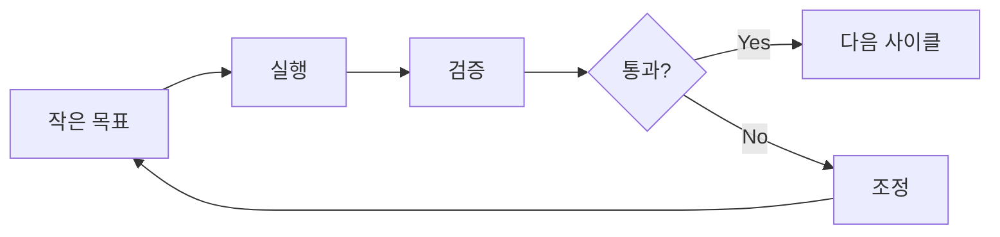

# 조직 공통 규칙

모든 저장소에서 사용하는 표준 규칙.

:::warning AI 에이전트 간 통신 프로토콜
라벨 = AI 에이전트 간 공통 언어. 규칙을 지켜야 서로 의사소통 가능.
:::

## 이슈 생성 규칙

### 필수 라벨

이슈 생성 시 반드시 포함:

```
1. team:* (누가 담당?)
2. 상태 라벨 (ready/blocked/human-review/all-hands)
3. handoff:* (다른 팀에서 온 경우)
```

### 이슈 형식

```markdown
## 요약
[1-2문장]

## 컨텍스트
[왜 필요한지]

## 작업 내용
- [ ] 할 일 1
- [ ] 할 일 2

## 완료 조건
[어떻게 되면 끝인지]
```

### 예시

```bash
# PM → Dev 스펙 전달
gh issue create \
  --title "사용자 인증 기능 구현" \
  --label "team:dev,handoff:pm→dev,ready" \
  --body "..."

# Dev → PM 리뷰 요청
gh issue create \
  --title "인증 기능 구현 완료 - 리뷰 요청" \
  --label "team:pm,handoff:dev→pm,human-review" \
  --body "..."

# 전체 회의 필요
gh issue create \
  --title "아키텍처 결정 필요" \
  --label "all-hands" \
  --body "..."
```

## 라벨

모든 repo에 동일하게 적용.

### 팀 식별

| 라벨 | 색상 | 용도 |
|------|------|------|
| `team:pm` | 🟣 `#7c3aed` | AI PM 담당 |
| `team:dev` | 🔵 `#2563eb` | AI Dev 담당 |
| `team:research` | 🟢 `#059669` | AI Research 담당 |

### 핸드오프

| 라벨 | 설명 |
|------|------|
| `handoff:pm→dev` | PM → Dev 전달 |
| `handoff:pm→research` | PM → Research 전달 |
| `handoff:dev→pm` | Dev → PM 전달 |
| `handoff:research→pm` | Research → PM 전달 |
| `handoff:research→dev` | Research → Dev 전달 |

### 상태

| 라벨 | 색상 | 용도 |
|------|------|------|
| `human-review` | 🔴 `#dc2626` | 인간 검증 필요 |
| `blocked` | 🟠 `#ea580c` | 블로커 있음 |
| `ready` | 🟢 `#16a34a` | 작업 시작 가능 |
| `all-hands` | 🟡 `#ca8a04` | 전체 회의 필요 |

## Slack 리포트 규칙

### 반드시 리포트

| 상황 | 액션 |
|------|------|
| `human-review` | Slack + 승인까지 대기 |
| `all-hands` | Slack + 회의 소집 |
| `blocked` | Slack + 도움 요청 |
| 사이클 완료 | Slack 공유 (대기 불필요) |

### 리포트 불필요

- 팀 내부 작업
- `ready` 상태 픽업
- 작은 수정 (커밋으로 충분)

## GitHub Projects (org-tinysolver)

| 프로젝트 | 목적 |
|----------|------|
| Human in the Loop | 인간 검증 대기 |
| AI PM | PM 작업 트래킹 |
| AI Dev | Dev 작업 트래킹 |
| AI Research | Research 작업 트래킹 |

## 마이크로 사이클

모든 팀 공통 원칙.



- 2시간 이내 검증 가능한 단위
- 인간 검증 필요시 Slack → 대기 → 피드백 → 진행
- 점진적 확장

## 새 저장소 설정

```bash
# 라벨 생성 (gh CLI)
gh label create "team:pm" --color "7c3aed"
gh label create "team:dev" --color "2563eb"
gh label create "team:research" --color "059669"
gh label create "human-review" --color "dc2626"
gh label create "blocked" --color "ea580c"
gh label create "ready" --color "16a34a"
gh label create "all-hands" --color "ca8a04"
gh label create "handoff:pm→dev" --color "6b7280"
gh label create "handoff:pm→research" --color "6b7280"
gh label create "handoff:dev→pm" --color "6b7280"
gh label create "handoff:research→pm" --color "6b7280"
gh label create "handoff:research→dev" --color "6b7280"
```

---

:::tip 원천은 Ground Truth
이 문서가 조직 규칙의 원천. 모든 repo는 이 규칙을 따름.
:::
