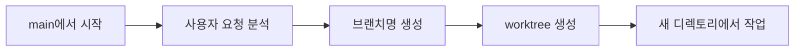
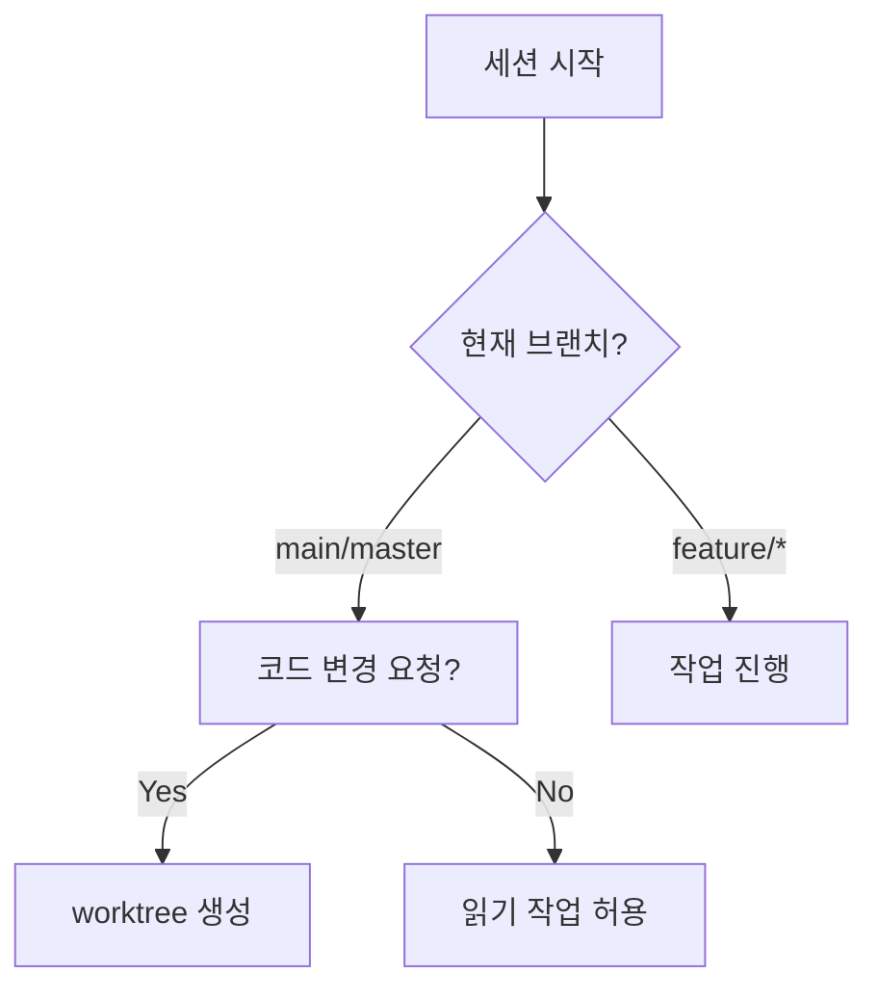

# 브랜치 보호 규칙

main 브랜치에서 직접 코드 변경을 금지하고, 모든 작업을 feature 브랜치에서 수행하도록 합니다.

## 보호 브랜치

```
main
master
develop
```

## 규칙

### main 브랜치에서 세션 시작 시



### 브랜치명 규칙

```
feature/{작업요약}-{YYYYMMDD-HHMM}
```

예시:
```
feature/login-refactor-20251214-1158
feature/hero-title-update-20251215-0930
```

### Worktree 생성

```bash
# 1. 브랜치명 생성
BRANCH="feature/hero-title-update-$(date +%Y%m%d-%H%M)"

# 2. worktree 생성
git worktree add -b "$BRANCH" "../$BRANCH"

# 3. 새 디렉토리로 이동
cd "../$BRANCH"

# 4. 작업 수행
# ...

# 5. 작업 완료 후 정리
git worktree remove "../$BRANCH"
```

## main에서 허용되는 작업

코드 **변경 없이** 가능한 작업:

```
✅ 코드 읽기 및 분석
✅ 현황 확인 (/pm-status)
✅ 회의록 작성 (/pm-meeting-log)
✅ 코드 변경 없는 조사/리서치
```

## main에서 금지되는 작업

```
❌ 파일 생성/수정/삭제
❌ git commit
❌ 코드 수정
```

## Slack 알림

새 worktree 생성 시 알림:

```json
{
  "branch": "feature/hero-title-update-20251214-1158",
  "worktree": "../feature/hero-title-update-20251214-1158",
  "trigger": "Hero 섹션 타이틀 변경"
}
```

## 자동 감지



---

:::danger 위반 시
main에서 코드 변경 시도 시 자동으로 worktree 생성 유도.
작업 중단 및 브랜치 전환 필수.
:::
