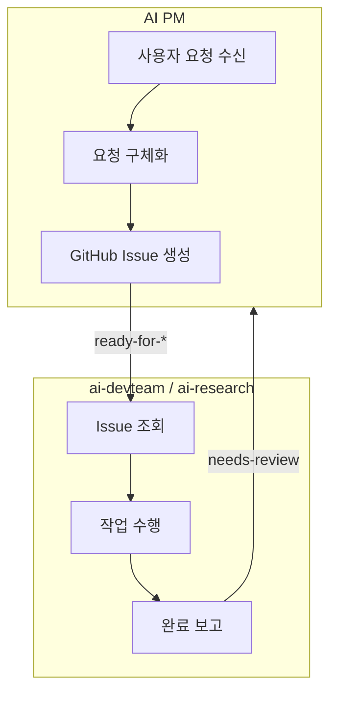
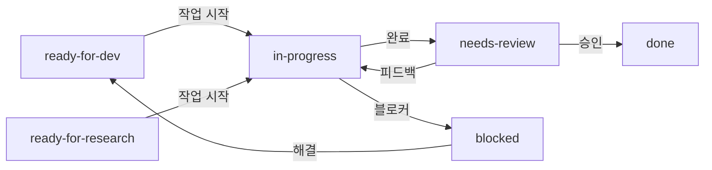

# 위임 프로토콜

AI PM과 실행 에이전트(ai-devteam, ai-research) 간의 통신 규약입니다.

## 전체 흐름



## Issue 기반 위임

### PM → DevTeam

```bash
gh issue create -R org-tinysolver/<repo> \
  --title "[DEV] Hero 섹션 타이틀 변경" \
  --body "$(cat <<'EOF'
## 이 Issue에서 해야 할 것
Hero 섹션의 타이틀 변경

## 수정할 파일
| 파일 | 변경 내용 |
|------|----------|
| `app/components/Hero.tsx` | h1 텍스트 변경 |

## 구체적인 변경 사항
**현재:**
\`\`\`tsx
<h1>Hello World</h1>
\`\`\`

**변경 후:**
\`\`\`tsx
<h1>Welcome to TinySolver</h1>
\`\`\`

## 완료 조건
- [ ] 타이틀 변경됨
- [ ] 빌드 성공
- [ ] Preview 배포 확인

## 메타
| 항목 | 값 |
|------|---|
| 예상 소요 | 10분 |
| 우선순위 | P2 |
EOF
)" \
  --label "ai-pm,ready-for-dev,P2"
```

### PM → Research

```bash
gh issue create -R org-tinysolver/ai-research \
  --title "[RESEARCH] Remix vs Next.js 비교 분석" \
  --body "$(cat <<'EOF'
## 리서치 목표
Remix와 Next.js의 SSR 성능 및 DX 비교

## 분석 항목
- [ ] 초기 로딩 성능
- [ ] 라우팅 방식
- [ ] 데이터 페칭 패턴
- [ ] Cloudflare 호환성

## 산출물
`outputs/analysis/YYYY-MM-DD-remix-vs-nextjs.md`

## 완료 조건
- [ ] 비교 리포트 작성 완료
- [ ] 결론 및 권장사항 포함
EOF
)" \
  --label "ai-pm,ready-for-research,P2"
```

## 라벨 상태 전이



## 위임 라벨 체계

| 라벨 | 의미 | 대상 |
|------|------|------|
| `ready-for-dev` | 개발 작업 대기 | ai-devteam |
| `ready-for-research` | 리서치 작업 대기 | ai-research |
| `in-progress` | 작업 중 | - |
| `needs-review` | HITL 리뷰 필요 | Human |
| `blocked` | 선행 작업 대기 | - |
| `done` | 완료 | - |

## 에이전트 시작 프로토콜

### 1. 로컬 상태 캐시 확인

```yaml
# .agent/status.yaml
last_sync: "2025-12-13T10:00:00+09:00"
current_task:
  issue_number: 123
  repo: "org-tinysolver/tinysolver.me"
  title: "Hero 섹션 타이틀 변경"
  status: "in_progress"
```

### 2. GitHub 동기화

```bash
# ready-for-* Issue 조회
gh issue list -R org-tinysolver/<repo> \
  --label "ready-for-dev" \
  --state open \
  --json number,title,labels
```

### 3. 작업 시작

```bash
# 라벨 변경
gh issue edit <N> -R org-tinysolver/<repo> \
  --remove-label "ready-for-dev" \
  --add-label "in-progress"
```

## 작업 완료 프로토콜

### 1. PR 생성

```bash
gh pr create -R org-tinysolver/<repo> \
  --title "feat: Hero 타이틀 변경 (#123)" \
  --body "## Summary\n- Hero 섹션 타이틀 변경\n\nCloses #123"
```

### 2. 라벨 변경

```bash
gh issue edit <N> -R org-tinysolver/<repo> \
  --remove-label "in-progress" \
  --add-label "needs-review"
```

### 3. 완료 코멘트

```bash
gh issue comment <N> -R org-tinysolver/<repo> \
  --body "## 작업 완료\n**PR**: #456\n**Preview**: https://xxx.pages.dev"
```

## 에러 핸들링

### 블로커 발생 시

```bash
gh issue edit <N> \
  --remove-label "in-progress" \
  --add-label "blocked"

gh issue comment <N> \
  --body "## Blocked\n**Reason**: API 미구현\n\n**필요**: Issue #120 선행 작업"
```

### 30분 초과 시

```bash
gh issue comment <N> \
  --body "## Timeout Warning\n**경과**: 35분\n**예상**: 10분\n\n**제안**: Issue 분할 권장"
```

---

:::tip Quick Reference
```bash
# PM: 위임
gh issue create ... --label "ready-for-dev"

# Agent: 시작
gh issue edit N --remove-label "ready-for-dev" --add-label "in-progress"

# Agent: 완료
gh issue edit N --remove-label "in-progress" --add-label "needs-review"

# Human: 승인
gh issue edit N --remove-label "needs-review" --add-label "done"
gh issue close N
```
:::
