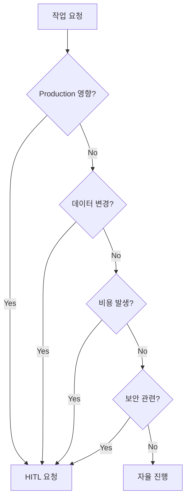

# HITL 경계 (Human-in-the-Loop)

AI 에이전트의 자율 범위와 인간 승인이 필요한 범위를 정의합니다.

## 원칙

> **안전한 자율성**: 되돌릴 수 있는 작업만 자율 수행

## 자율 가능 (No HITL)

### 코드 작업

```
✅ 새 기능 구현
✅ 버그 수정
✅ 리팩토링
✅ 테스트 작성
```

### Preview 배포

```
✅ Cloudflare Workers Preview
✅ Vercel Preview
✅ GitHub Pages Preview
✅ 로컬 개발 서버
```

### Git/GitHub

```
✅ 브랜치 생성
✅ 커밋
✅ PR 생성
✅ Issue 라벨 변경
```

### 기술 결정

```
✅ 라이브러리 선택
✅ 아키텍처 패턴
✅ 코드 구조
```

## 승인 필요 (HITL Required)

### Production 배포

```
❌ main 브랜치 머지
❌ Production 배포
❌ DNS 설정 변경
❌ 도메인 설정
```

### 데이터

```
❌ DB 스키마 변경
❌ 마이그레이션 실행
❌ 데이터 삭제/수정
```

### 외부 연동

```
❌ 결제 서비스 (Stripe 등)
❌ 인증 서비스 (Auth0, Clerk 등)
❌ 외부 API 키 사용
```

### 보안

```
❌ 환경 변수/시크릿 추가
❌ 권한 설정 변경
❌ 인증/인가 로직
```

### 비용

```
❌ 유료 서비스 도입
❌ 리소스 스케일 업
```

## HITL 요청 방법

```bash
# PM에게 승인 요청 Issue 생성
gh issue create -R org-tinysolver/ai-pm \
  --title "[HITL] <승인 필요 사항>" \
  --body "$(cat <<'EOF'
## 요청 사항
<구체적인 내용>

## 이유
<왜 이 작업이 필요한지>

## 영향 범위
<어떤 것들이 영향받는지>

## 롤백 계획
<문제 시 되돌리는 방법>
EOF
)" \
  --label "hitl-request,human-review"
```

## 판단 플로우



## 체크리스트

import Checklist from '@site/src/components/Checklist';

<Checklist items={[
  { id: 'production', label: 'Production 배포가 아님' },
  { id: 'data', label: '데이터 삭제/수정 없음' },
  { id: 'cost', label: '추가 비용 발생 없음' },
  { id: 'security', label: '보안 설정 변경 없음' },
  { id: 'external', label: '외부 유료 서비스 연동 없음' },
]} />

---

:::warning 불확실할 때
판단이 어려우면 무조건 HITL 요청. 안전 우선.
:::
