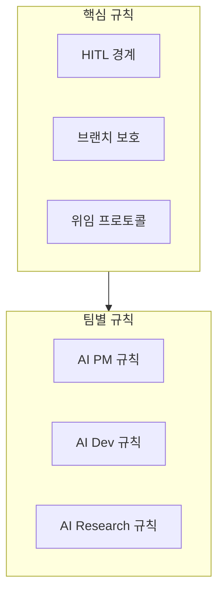

# AI Agent 규칙 개요

모든 AI 에이전트가 따라야 하는 핵심 규칙입니다.

## 규칙 체계



## 핵심 규칙 목록

| 규칙 | 설명 | 위반 시 |
|------|------|---------|
| [HITL 경계](./hitl-boundary) | 인간 승인 필요 범위 | 작업 중단 + 승인 요청 |
| [브랜치 보호](./branch-protection) | main 브랜치 코드 변경 금지 | worktree 생성 필수 |
| [위임 프로토콜](./delegation-protocol) | 팀 간 작업 전달 규약 | Issue 기반 통신 |

## 공통 원칙

### 30분 Rule

모든 작업은 30분 이내 완료 가능한 단위로 분할

```
❌ "사용자 인증 시스템 구현"
✅ "로그인 폼 UI 구현" → "토큰 저장 로직" → "로그아웃 버튼"
```

### Self-Contained Issue

Issue만 보고 작업 가능해야 함. 외부 참조 최소화.

```markdown
## 좋은 예
| 파일 | 변경 내용 |
|------|----------|
| `app/Hero.tsx` | h1 텍스트 변경 |

**현재:** `<h1>Hello</h1>`
**변경:** `<h1>Welcome</h1>`

## 나쁜 예
"이전에 논의한 대로 수정해주세요"
```

### Slack 리포트

| 상황 | 액션 |
|------|------|
| HITL 필요 | Slack 알림 + 승인 대기 |
| 블로커 발생 | Slack 알림 + 도움 요청 |
| 작업 완료 | Slack 공유 (대기 불필요) |
