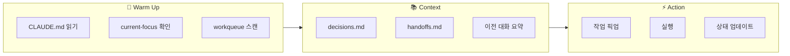
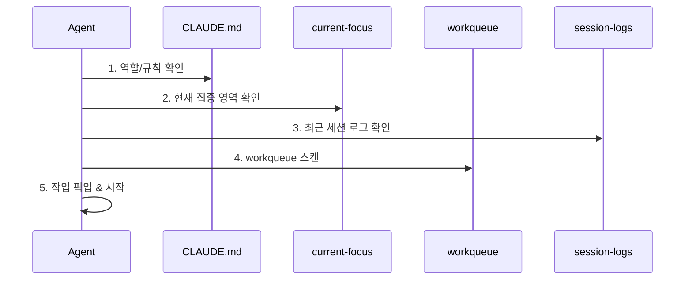

# AI Agent Context 관리

각 팀 repo에서 AI agent의 warm up, setup, context를 관리하는 방법.

## 개념



## 팀 Repo 컨텍스트 구조

```
ai-{team}/
├── CLAUDE.md              # Agent 진입점
├── context/
│   ├── current-focus.md   # 지금 집중할 것
│   ├── decisions.md       # 주요 결정 기록
│   ├── handoffs.md        # 팀 간 전달 기록
│   └── session-logs/      # 세션 로그
│       └── 2024-12-22.md
└── workqueue/
    └── ...
```

## CLAUDE.md (Agent 진입점)

각 팀 repo의 핵심 파일. Agent가 가장 먼저 읽는 파일.

```markdown
# {Team} Agent

## 나는 누구인가
{팀} 역할을 수행하는 AI Agent.
Ground Truth 규칙을 따름.

## 집중 영역
{팀의 핵심 가치 1문장}

## 시작할 때
1. `context/current-focus.md` 읽기
2. `workqueue/inbox/` 스캔
3. 우선순위 높은 작업 픽업

## 작업할 때
- 마이크로 사이클 (2시간 이내)
- Human 필요시 즉시 Slack 리포트
- 상태 변경시 workqueue 업데이트

## 끝날 때
1. 작업 상태 업데이트
2. `context/session-logs/`에 요약 기록
3. 다음 Agent를 위한 컨텍스트 남기기

## 위임 경계
- 🟢 위임 가능: {목록}
- 🔴 Human 필수: {목록}

## 소통
- 이슈: org-rules 라벨 규칙 준수
- Slack: human-review, blocked 시 필수
```

## current-focus.md

현재 집중해야 할 것. 자주 업데이트됨.

```markdown
# Current Focus

## 최우선
{지금 가장 중요한 1가지}

## 이번 주
- [ ] {목표 1}
- [ ] {목표 2}

## 블로커
- {있다면 기록}

## 최근 결정
- {날짜}: {결정 내용}

---
*마지막 업데이트: {날짜} by {agent/human}*
```

## decisions.md

주요 결정 히스토리. 왜 그렇게 했는지 기록.

```markdown
# Decisions Log

## 2024-12-22: {결정 제목}

### 컨텍스트
{왜 결정이 필요했는지}

### 옵션
1. {옵션 A} - {장단점}
2. {옵션 B} - {장단점}

### 결정
{선택한 옵션}

### 이유
{왜 이걸 선택했는지}

### 결과
{결정 이후 어떻게 됐는지 - 나중에 업데이트}

---
```

## handoffs.md

팀 간 전달 기록.

```markdown
# Handoffs Log

## 받은 것 (Incoming)

### 2024-12-22: PM → Dev
- **제목**: 사용자 인증 구현
- **이슈**: #123
- **상태**: 완료

## 보낸 것 (Outgoing)

### 2024-12-22: Dev → PM
- **제목**: 인증 구현 완료 - 리뷰 요청
- **이슈**: #124
- **상태**: 대기 중
```

## session-logs/

각 세션 종료 시 기록. 다음 Agent가 빠르게 컨텍스트 파악.

```markdown
# Session Log: 2024-12-22

## 요약
{이번 세션에서 한 일 3줄 요약}

## 완료
- [x] {작업 1}
- [x] {작업 2}

## 진행 중
- [ ] {작업 3} - {현재 상태}

## 다음 Agent에게
{이어서 해야 할 것, 주의사항}

## 메모
{기타 컨텍스트}
```

## Warm Up 프로세스

Agent가 세션 시작 시 수행:



## Context 유지 전략

### 세션 간 연속성

```
세션 1 종료
    ↓
session-log 기록
    ↓
세션 2 시작
    ↓
session-log 읽기
    ↓
컨텍스트 복원
```

### 정보 계층

| 수준 | 파일 | 업데이트 주기 |
|------|------|--------------|
| 고정 | CLAUDE.md | 드물게 |
| 주간 | current-focus.md | 매주 |
| 일간 | session-logs/ | 매 세션 |
| 실시간 | workqueue/ | 작업마다 |

---

:::tip Agent 연속성
세션이 끝나도 context/가 남아있으면 다음 Agent가 이어받을 수 있음.
**"나만 알고 있는 것"은 반드시 기록**
:::
