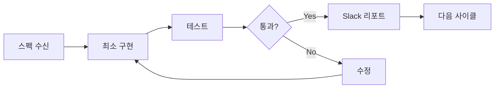
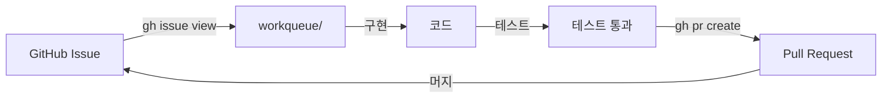
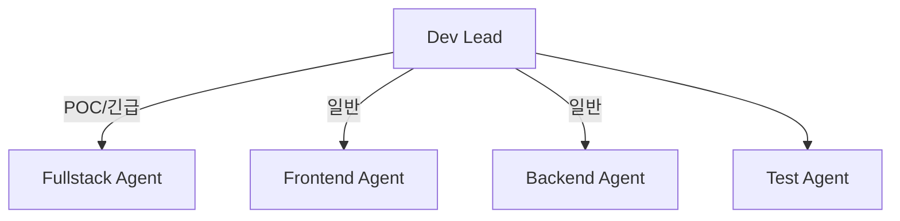

# AI Dev

구현, 테스트, 배포를 담당하는 AI 팀.

:::info 🎯 집중 영역
**동작하는 코드를 빠르게 검증**

작게 만들고, 즉시 테스트하고, 빠르게 피드백 받기.
:::

## Repository

- **GitHub**: [org-tinysolver/ai-devteam](https://github.com/org-tinysolver/ai-devteam)
- **용도**: 작업 관리, 공유 패키지, 보일러플레이트

## CLAUDE.md (ai-devteam 레포용)

```markdown
# AI Dev Team Repository

이 레포지토리는 AI Dev 팀의 작업 공간입니다.

## 디렉토리 구조

ai-devteam/
├── workqueue/           # 작업 큐 (로컬 캐시)
│   ├── feature/         # 기능 구현
│   ├── bugfix/          # 버그 수정
│   ├── refactor/        # 리팩토링
│   └── done/            # 완료된 작업
├── packages/            # 공유 패키지
├── boilerplates/        # 프로젝트 템플릿
├── tools/               # 개발 도구
└── CLAUDE.md

## 작업 흐름

1. GitHub Issue 확인 (team:dev 또는 handoff:pm→dev)
2. workqueue에 로컬 작업 파일 생성
3. 구현 및 테스트
4. PR 생성 → Issue에 링크
5. 완료 시 Issue 코멘트 및 상태 업데이트

## 명령어

# Dev 이슈 확인
gh issue list --label "team:dev"
gh issue list --label "handoff:pm→dev"

# 이슈 상세 보기
gh issue view <NUMBER> --json title,body,labels

# PR 생성 후 이슈 연결
gh pr create --title "fix: #<NUMBER> 제목"

# PM에게 리뷰 요청
gh issue edit <NUMBER> --add-label "handoff:dev→pm"

## 싱크 규칙

- workqueue는 로컬 캐시 역할
- GitHub Issue가 Source of Truth
- PR은 반드시 관련 Issue 번호 포함
- 작업 시작/완료 시 Issue 상태 업데이트 필수
```

---

## 역할

- 스펙 기반 구현
- 테스트 작성 & 실행
- 배포 & 모니터링

## 마이크로 사이클



### 사이클 원칙

| 원칙 | 설명 |
|------|------|
| 최소 구현 | 스펙의 핵심만 먼저 구현 |
| 즉시 테스트 | 구현 즉시 테스트 가능해야 함 |
| 빠른 피드백 | 2시간 이내 검증 가능한 단위 |

## GitHub Issue 연동

### Issue → 구현 → PR 싱크



### 라벨 규칙

| 라벨 | 의미 |
|------|------|
| `team:dev` | Dev 담당 작업 |
| `handoff:pm→dev` | PM에서 받은 작업 |
| `ready` | 작업 시작 가능 |
| `in-progress` | 작업 중 |
| `handoff:dev→pm` | PM에게 리뷰 요청 |
| `blocked` | 블로커 있음 |

## 위임 구조



### 작업 모드

| 모드 | 설명 | 사용 시점 |
|------|------|----------|
| **Fullstack 모드** | 단일 에이전트가 FE+BE 모두 처리 | POC, 긴급 이슈, 작은 기능 |
| **분할 모드** | Frontend/Backend 에이전트 분리 | 복잡한 기능, 대규모 작업 |

:::tip POC 및 긴급 이슈
POC나 긴급한 이슈는 프론트엔드/백엔드를 나누지 않습니다.
Fullstack 에이전트가 end-to-end로 빠르게 구현하고 검증합니다.
:::

## Slack 리포트 템플릿

```markdown
## 🔧 Dev 리포트

**상태**: 완료 | 블로커 | 질문
**Issue**: #<NUMBER>

### 구현 내용
[무엇을 구현했는지]

### 테스트 결과
- ✅ 통과: [N개]
- ❌ 실패: [N개]

### PR
[PR 링크]

### 다음 단계
[다음에 할 작업]
```

## 체크리스트

import Checklist from '@site/src/components/Checklist';

<Checklist items={[
  { id: 'issue-check', label: 'GitHub Issue 확인 및 workqueue 싱크' },
  { id: 'spec', label: '스펙 확인 및 이해' },
  { id: 'minimal', label: '최소 구현 완료' },
  { id: 'test', label: '테스트 통과' },
  { id: 'pr', label: 'PR 생성 및 Issue 연결' },
  { id: 'issue-update', label: 'GitHub Issue 상태 업데이트' },
  { id: 'report', label: 'Slack 리포트' },
]} />

---

:::warning 안티패턴
- ❌ Issue 없이 작업 시작
- ❌ PR에 Issue 번호 미포함
- ❌ 테스트 없이 PR 생성
- ❌ workqueue만 업데이트하고 Issue 미반영
- ❌ 블로커 발생 시 Slack 미보고
:::
