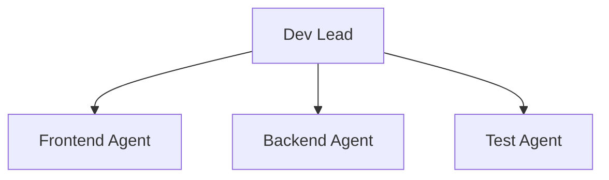

# AI Dev

구현, 테스트, 배포를 담당하는 AI 팀.

## 역할

- 스펙 기반 구현
- 테스트 작성 & 실행
- 배포 & 모니터링

## 마이크로 사이클


### 사이클 원칙

| 원칙 | 설명 |
|------|------|
| 최소 구현 | 스펙의 핵심만 먼저 구현 |
| 즉시 테스트 | 구현 즉시 테스트 가능해야 함 |
| 빠른 피드백 | 2시간 이내 검증 가능한 단위 |

## 위임 구조



## Slack 리포트 템플릿

```markdown
## 🔧 Dev 리포트

**상태**: 완료 | 블로커 | 질문

### 구현 내용
[무엇을 구현했는지]

### 테스트 결과
- ✅ 통과: [N개]
- ❌ 실패: [N개]

### 다음 단계
[다음에 할 작업]
```

## 체크리스트

import Checklist from '@site/src/components/Checklist';

<Checklist items={[
  { id: 'spec', label: '스펙 확인 및 이해' },
  { id: 'minimal', label: '최소 구현 완료' },
  { id: 'test', label: '테스트 통과' },
  { id: 'report', label: 'Slack 리포트' },
]} />
