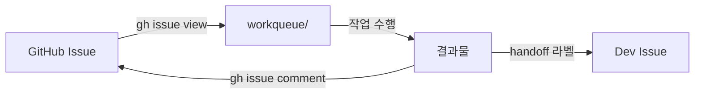

# AI PM

제품 기획, 우선순위 결정, 스펙 작성을 담당하는 AI 팀.

:::info 🎯 집중 영역
**명확한 스펙으로 Dev 블로커 제거**

Dev가 "무엇을 만들어야 하는지" 고민하지 않도록.
:::

## Repository

- **GitHub**: [org-tinysolver/ai-pm](https://github.com/org-tinysolver/ai-pm)
- **용도**: 작업 관리, PM 도구, 템플릿

## CLAUDE.md (ai-pm 레포용)

```markdown
# AI PM Repository

이 레포지토리는 AI PM 팀의 작업 공간입니다.

## 디렉토리 구조

ai-pm/
├── workqueue/           # 작업 큐 (로컬 캐시)
│   ├── spec/            # 스펙 작성 작업
│   ├── research/        # 리서치 요청
│   ├── review/          # 리뷰 대기
│   └── done/            # 완료된 작업
├── templates/           # PRD, 스펙 템플릿
├── tools/               # PM 도구
└── CLAUDE.md

## 작업 흐름

1. GitHub Issue 확인 → workqueue에 로컬 복사
2. 작업 수행 (스펙 작성, 분석 등)
3. 결과를 GitHub Issue에 코멘트
4. 필요시 handoff 라벨로 Dev/Research에 전달

## 명령어

# 이슈 목록 확인
gh issue list --label "team:pm"

# 새 이슈 가져오기
gh issue view <NUMBER> --json title,body,labels

# Dev에게 전달
gh issue edit <NUMBER> --add-label "handoff:pm→dev"

## 싱크 규칙

- workqueue는 로컬 캐시 역할
- GitHub Issue가 Source of Truth
- 작업 시작/완료 시 Issue 상태 업데이트 필수
```

---

## 역할


## 마이크로 사이클

### 사이클 구조


### 사이클 예시

| 단계 | 시간 | 산출물 |
|------|------|--------|
| 문제 정의 | 30분 | 1문장 문제 정의 |
| 가설 수립 | 30분 | 검증 가능한 가설 1개 |
| 최소 스펙 | 1시간 | 마이크로 PRD |
| 리포트 & 피드백 | - | Slack 스레드 |

**총 사이클: 2시간 이내**

## GitHub Issue 연동

### Issue → Workqueue 싱크



### 라벨 규칙

| 라벨 | 의미 |
|------|------|
| `team:pm` | PM 담당 작업 |
| `ready` | 작업 시작 가능 |
| `in-progress` | 작업 중 |
| `handoff:pm→dev` | Dev에게 전달 |
| `handoff:pm→research` | Research에게 전달 |
| `human-review` | 인간 승인 필요 |

## 위임 구조


### 위임 규칙

1. **위임 가능**: 상세 스펙 작성, 데이터 분석, 리서치
2. **위임 불가**: 최종 우선순위 결정, 승인 요청

## Slack 리포트 템플릿

```markdown
## 🎯 PM 리포트

**유형**: 스펙 승인 요청 | 우선순위 제안 | 질문

### 컨텍스트
[왜 이 작업이 필요한지]

### 제안
[구체적인 제안 내용]

### 검증 기준
[어떻게 성공을 측정할지]

### 요청
- [ ] 승인
- [ ] 피드백 필요
- [ ] 질문 답변 필요
```

## 산출물

### 마이크로 PRD

```markdown
# [기능명]

## 문제
[1-2문장으로 문제 정의]

## 가설
[검증하고자 하는 가설]

## 범위
- ✅ 포함: [최소 범위]
- ❌ 제외: [명시적 제외]

## 성공 기준
[측정 가능한 기준]

## 다음 단계
[이 사이클 이후 예상되는 다음 스텝]
```

## 체크리스트

import Checklist from '@site/src/components/Checklist';

<Checklist items={[
  { id: 'issue-check', label: 'GitHub Issue 확인 및 workqueue 싱크' },
  { id: 'context', label: 'Ground Truth에서 관련 컨텍스트 확인' },
  { id: 'problem', label: '1문장으로 문제 정의' },
  { id: 'hypothesis', label: '검증 가능한 가설 수립' },
  { id: 'micro-spec', label: '마이크로 스펙 작성 (2시간 이내 검증 가능)' },
  { id: 'report', label: 'Slack 리포트 작성' },
  { id: 'issue-update', label: 'GitHub Issue 상태 업데이트' },
  { id: 'feedback', label: '피드백 대기 및 반영' },
]} />

---

:::warning 안티패턴
- ❌ 큰 스펙을 한 번에 작성
- ❌ 승인 없이 Dev에 전달
- ❌ 피드백 없이 다음 사이클 진행
- ❌ GitHub Issue 없이 작업 시작
- ❌ workqueue만 업데이트하고 Issue 미반영
:::
