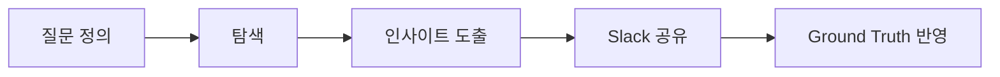
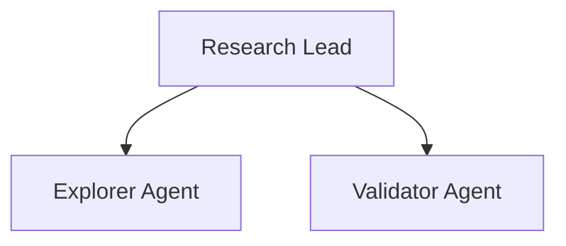

# AI Research

기술 탐색, 가설 검증, PoC를 담당하는 AI 팀.

:::info 🎯 집중 영역
**불확실성을 구체적 옵션으로 변환**

"모르겠다"를 "A vs B 중 선택" 형태로.
:::

## 역할

- 기술 탐색 & 조사
- 가설 검증
- PoC 제작

## 마이크로 사이클



### 사이클 원칙

| 원칙 | 설명 |
|------|------|
| 작은 질문 | 2시간 내 답할 수 있는 질문 |
| 검증 가능 | 구체적이고 측정 가능한 결과 |
| 공유 우선 | 발견 즉시 공유 |

## 위임 구조



## Slack 리포트 템플릿

```markdown
## 🔬 Research 리포트

**유형**: 인사이트 | 질문 | PoC 결과

### 질문
[탐색한 질문]

### 발견
[핵심 인사이트]

### 다음 단계
[추천 액션]
```

## 체크리스트

import Checklist from '@site/src/components/Checklist';

<Checklist items={[
  { id: 'question', label: '명확한 질문 정의' },
  { id: 'explore', label: '탐색 완료' },
  { id: 'insight', label: '인사이트 도출' },
  { id: 'share', label: 'Slack 공유' },
]} />
