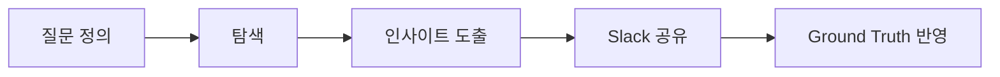
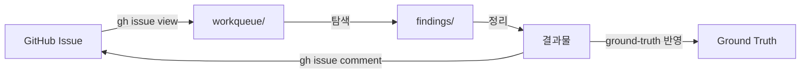
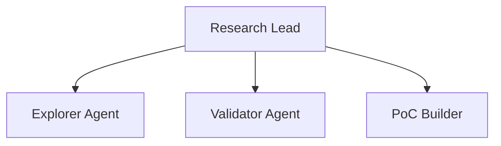

# AI Research

기술 탐색, 가설 검증, PoC를 담당하는 AI 팀.

:::info 🎯 집중 영역
**불확실성을 구체적 옵션으로 변환**

"모르겠다"를 "A vs B 중 선택" 형태로.
:::

## Repository

- **GitHub**: [org-tinysolver/ai-research](https://github.com/org-tinysolver/ai-research)
- **용도**: 작업 관리, 리서치 결과, PoC 코드

## CLAUDE.md (ai-research 레포용)

```markdown
# AI Research Repository

이 레포지토리는 AI Research 팀의 작업 공간입니다.

## 디렉토리 구조

ai-research/
├── workqueue/           # 작업 큐 (로컬 캐시)
│   ├── explore/         # 탐색 작업
│   ├── validate/        # 검증 작업
│   ├── poc/             # PoC 작업
│   └── done/            # 완료된 작업
├── findings/            # 리서치 결과물
│   ├── YYYY-MM/         # 월별 정리
│   └── index.md         # 인덱스
├── poc/                 # PoC 코드
└── CLAUDE.md

## 작업 흐름

1. GitHub Issue 확인 (team:research 또는 handoff:*→research)
2. workqueue에 로컬 작업 파일 생성
3. 탐색/검증 수행
4. findings/에 결과 정리
5. Issue에 결과 코멘트 및 Ground Truth 반영 요청

## 명령어

# Research 이슈 확인
gh issue list --label "team:research"
gh issue list --label "handoff:pm→research"

# 이슈 상세 보기
gh issue view <NUMBER> --json title,body,labels

# 결과 공유 후 PM에게 전달
gh issue edit <NUMBER> --add-label "handoff:research→pm"

# Ground Truth 반영 요청
gh issue create --repo org-tinysolver/ground-truth \
  --title "Research 결과 반영: [제목]" \
  --label "team:pm,handoff:research→pm"

## 싱크 규칙

- workqueue는 로컬 캐시 역할
- GitHub Issue가 Source of Truth
- 결과물은 findings/에 저장 후 Issue에 링크
- 중요 발견은 Ground Truth 반영 요청
```

---

## 역할

- 기술 탐색 & 조사
- 가설 검증
- PoC 제작

## 마이크로 사이클



### 사이클 원칙

| 원칙 | 설명 |
|------|------|
| 작은 질문 | 2시간 내 답할 수 있는 질문 |
| 검증 가능 | 구체적이고 측정 가능한 결과 |
| 공유 우선 | 발견 즉시 공유 |

## GitHub Issue 연동

### Issue → 탐색 → 결과 싱크



### 라벨 규칙

| 라벨 | 의미 |
|------|------|
| `team:research` | Research 담당 작업 |
| `handoff:pm→research` | PM에서 받은 작업 |
| `handoff:dev→research` | Dev에서 받은 작업 |
| `ready` | 작업 시작 가능 |
| `in-progress` | 작업 중 |
| `handoff:research→pm` | PM에게 결과 전달 |
| `handoff:research→dev` | Dev에게 PoC 전달 |

## 위임 구조



### 서브 에이전트 역할

| 에이전트 | 역할 |
|----------|------|
| **Explorer** | 넓게 탐색, 가능성 발굴 |
| **Validator** | 가설 검증, 비교 분석 |
| **PoC Builder** | 검증용 프로토타입 제작 |

## Slack 리포트 템플릿

```markdown
## 🔬 Research 리포트

**유형**: 인사이트 | 질문 | PoC 결과
**Issue**: #<NUMBER>

### 질문
[탐색한 질문]

### 발견
[핵심 인사이트]

### 증거
[데이터/출처]

### 다음 단계
[추천 액션]

### Ground Truth 반영
- [ ] 반영 필요
- [ ] 반영 완료: [링크]
```

## 산출물

### 리서치 결과물 템플릿

```markdown
# [제목]

- **날짜**: YYYY-MM-DD
- **Issue**: #<NUMBER>
- **상태**: 진행중 | 완료

## 질문
[탐색한 질문]

## 방법
[어떻게 조사했는지]

## 발견
### 핵심 인사이트
[가장 중요한 발견]

### 상세 내용
[구체적인 내용]

## 결론
[A vs B 형태의 선택지]

## 추천
[권장 방향]

## 참고자료
[출처 링크]
```

## 체크리스트

import Checklist from '@site/src/components/Checklist';

<Checklist items={[
  { id: 'issue-check', label: 'GitHub Issue 확인 및 workqueue 싱크' },
  { id: 'question', label: '명확한 질문 정의' },
  { id: 'explore', label: '탐색 완료' },
  { id: 'insight', label: '인사이트 도출' },
  { id: 'findings', label: 'findings/에 결과물 저장' },
  { id: 'issue-update', label: 'GitHub Issue 코멘트 및 상태 업데이트' },
  { id: 'share', label: 'Slack 공유' },
  { id: 'ground-truth', label: 'Ground Truth 반영 요청 (필요시)' },
]} />

---

:::warning 안티패턴
- ❌ Issue 없이 탐색 시작
- ❌ 발견을 findings/에 정리하지 않음
- ❌ 결론 없이 "더 조사 필요"로 끝냄
- ❌ Ground Truth 반영 누락
- ❌ workqueue만 업데이트하고 Issue 미반영
:::
