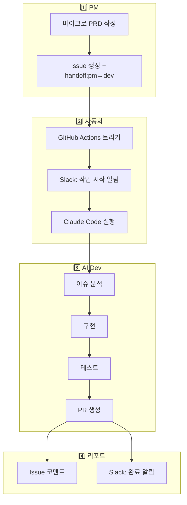

# 자동 위임 시스템

GitHub Issue 기반 PM→Dev 자동 위임 시스템.

:::info 🎯 목적
PM이 Issue를 생성하면 Dev가 자동으로 작업을 시작합니다.
수동 개입 없이 스펙→구현→리포트까지 자동화.
:::

## 워크플로우



## 설정 방법

### 1. 필수 Secrets 설정

GitHub 레포지토리 Settings → Secrets에 추가:

| Secret | 설명 |
|--------|------|
| `ANTHROPIC_API_KEY` | Claude API 키 |
| `SLACK_WEBHOOK_URL` | Slack 웹훅 URL |

### 2. 라벨 설정

```bash
./scripts/setup-labels.sh org-tinysolver/ground-truth
```

생성되는 라벨:
- `handoff:pm→dev` - PM→Dev 위임 트리거
- `handoff:pm→research` - PM→Research 위임
- `team:dev`, `team:pm`, `team:research`
- `ready`, `blocked`, `human-review`, `all-hands`

## 사용 방법

### PM이 Dev에게 위임

```bash
gh issue create \
  --repo org-tinysolver/ground-truth \
  --title "Ground Truth 다크 모드 추가" \
  --label "team:dev,handoff:pm→dev,ready" \
  --body "## 요약
다크 모드 토글 기능 추가

## 컨텍스트
사용자 요청 다수

## 작업 내용
- [ ] 다크 모드 CSS 추가
- [ ] 토글 버튼 구현

## 완료 조건
다크/라이트 전환 동작"
```

### 자동 실행 흐름

1. Issue 생성 시 `handoff:pm→dev` 라벨 감지
2. GitHub Actions 워크플로우 자동 시작
3. Slack에 "작업 시작" 알림
4. Claude Code가 이슈 분석 및 구현
5. 브랜치 생성 및 PR 오픈
6. Issue에 완료 코멘트
7. Slack에 "작업 완료" 알림

## Slack 알림 예시

### 작업 시작
```
🤖 AI Dev 작업 시작
이슈: #123 Ground Truth 다크 모드 추가
트리거: handoff:pm→dev
[📋 이슈 보기]
```

### 작업 완료
```
✅ AI Dev 작업 완료
이슈: #123
브랜치: ai-dev/issue-123
[📋 이슈] [🔍 Actions 로그]
```

## 트리거 조건

| 라벨 | 트리거 대상 | 워크플로우 |
|------|------------|-----------|
| `handoff:pm→dev` | AI Dev | `ai-dev-dispatch.yml` |
| `handoff:pm→research` | AI Research | (예정) |
| `handoff:dev→pm` | AI PM | (예정) |

## 제한사항

- 현재 `handoff:pm→dev`만 자동화됨
- Human 승인이 필요한 작업은 `human-review` 라벨로 중단
- PR은 자동 생성되지만 머지는 수동

## 확장 계획

1. `handoff:pm→research` 트리거 추가
2. `handoff:dev→pm` 리뷰 요청 자동화
3. 자동 테스트 실행 및 결과 리포트
4. 복잡한 작업의 서브태스크 분할
