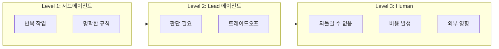
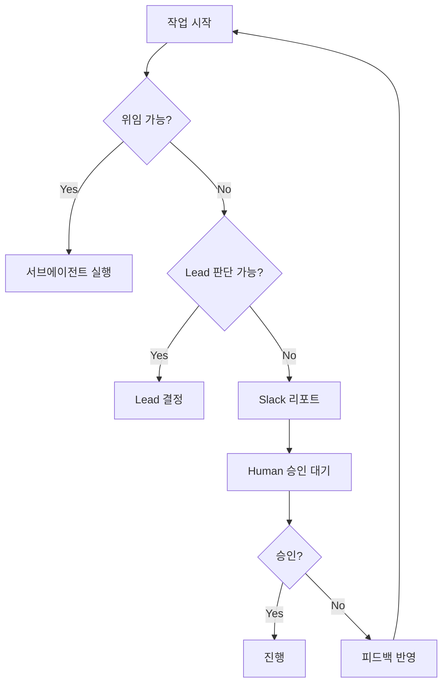

# 위임 경계와 Human in the Loop

각 팀의 위임 가능 범위와 사람 승인이 필요한 시점.

:::warning 핵심 원칙
**되돌릴 수 없는 작업 = 사람 승인 필수**
:::

## 위임 레벨



## 팀별 경계

### AI PM

| 레벨 | 작업 | 예시 |
|------|------|------|
| 🟢 서브에이전트 | 정보 수집 | 경쟁사 분석, 유저 피드백 정리 |
| 🟡 Lead | 스펙 작성 | PRD 초안, 우선순위 제안 |
| 🔴 Human | 방향 결정 | 로드맵 확정, 기능 드랍 |

**집중 영역**: 명확한 스펙으로 Dev 블로커 제거

### AI Dev

| 레벨 | 작업 | 예시 |
|------|------|------|
| 🟢 서브에이전트 | 반복 구현 | 테스트 작성, 린트 수정, 리팩토링 |
| 🟡 Lead | 설계 판단 | 아키텍처 결정, 라이브러리 선택 |
| 🔴 Human | 배포/삭제 | 프로덕션 배포, 데이터 삭제, 보안 설정 |

**집중 영역**: 동작하는 코드를 빠르게 검증

### AI Research

| 레벨 | 작업 | 예시 |
|------|------|------|
| 🟢 서브에이전트 | 탐색 | 문서 읽기, 코드 분석 |
| 🟡 Lead | 인사이트 도출 | 기술 평가, 추천 작성 |
| 🔴 Human | 도입 결정 | 새 기술 도입, 마이그레이션 |

**집중 영역**: 불확실성을 구체적 옵션으로 변환

## Human 필수 체크리스트

작업 전 확인:

```
□ 되돌릴 수 없는가? → Human
□ 비용이 발생하는가? → Human
□ 외부에 영향을 주는가? → Human
□ 보안 관련인가? → Human
□ 사용자 데이터를 다루는가? → Human
```

## 에스컬레이션 프로토콜



## 소통 규칙

[조직 공통 규칙](../org-rules)을 따름:

- **라벨**: `human-review`, `blocked`, `ready`
- **핸드오프**: `handoff:pm→dev` 형식
- **Slack**: `human-review` 시 반드시 리포트

---

:::tip 의심되면 물어봐
위임 레벨이 불확실하면 → Human에게 확인
:::
