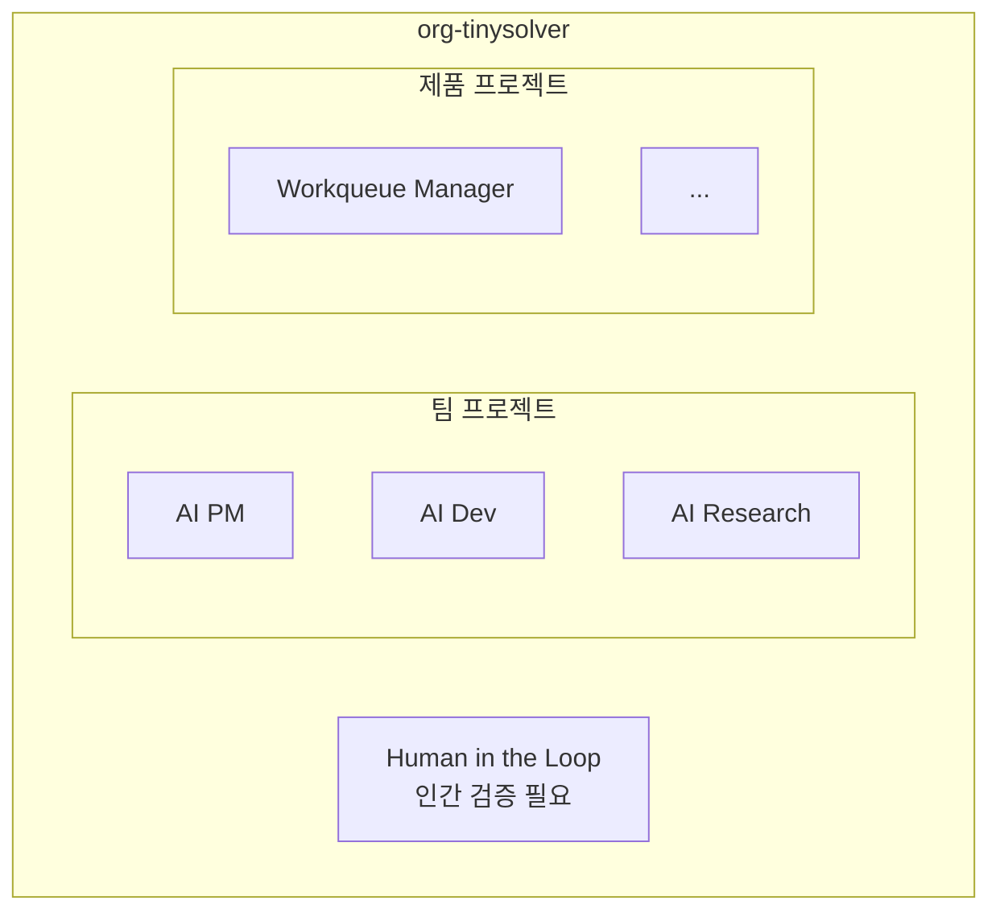
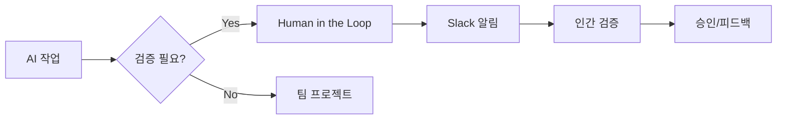
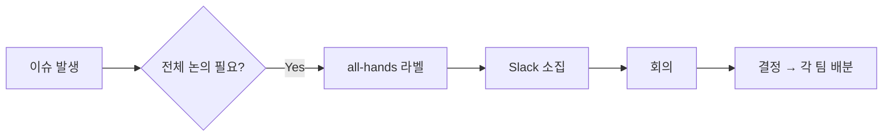
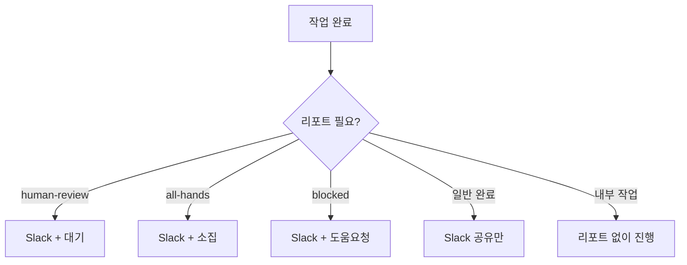

# GitHub Projects 구조

Organization 레벨 프로젝트 관리 체계.

## 프로젝트 구조



## 프로젝트 목록

| 프로젝트 | 목적 | 담당 |
|----------|------|------|
| **Human in the Loop** | 인간 승인/검증 대기 | 전체 |
| **AI PM** | PM 팀 작업 트래킹 | AI PM |
| **AI Dev** | Dev 팀 작업 트래킹 | AI Dev |
| **AI Research** | Research 팀 작업 트래킹 | AI Research |
| **Workqueue Manager** | 제품별 트래킹 | AI PM + Dev |

## Human in the Loop

인간 검증이 필요한 작업 집중 관리.



### 상태

| 상태 | 설명 |
|------|------|
| 대기 | 검증 대기 중 |
| 검토중 | 인간이 검토 중 |
| 승인 | 승인됨, 진행 가능 |
| 반려 | 수정 필요 |

## 라벨

### 팀 식별

내 팀 일 빠르게 필터링.

| 라벨 | 색상 | 용도 |
|------|------|------|
| `team:pm` | 🟣 보라 | AI PM 담당 |
| `team:dev` | 🔵 파랑 | AI Dev 담당 |
| `team:research` | 🟢 초록 | AI Research 담당 |

### 핸드오프

팀 간 작업 전달.

| 라벨 | 설명 |
|------|------|
| `handoff:pm→dev` | PM이 Dev에게 전달 |
| `handoff:pm→research` | PM이 Research에게 전달 |
| `handoff:dev→pm` | Dev가 PM에게 전달 (리뷰 요청 등) |
| `handoff:research→pm` | Research가 PM에게 전달 (인사이트) |
| `handoff:research→dev` | Research가 Dev에게 전달 (PoC 결과) |

### 상태

| 라벨 | 색상 | 용도 |
|------|------|------|
| `human-review` | 🔴 빨강 | 인간 검증 필요 |
| `blocked` | 🟠 주황 | 블로커 있음 |
| `ready` | 🟢 초록 | 작업 시작 가능 |
| `all-hands` | 🟡 노랑 | 전체 회의 필요 |

### 전체 회의 (All-Hands)

모든 팀이 모여야 하는 경우.



**사용 시점:**
- 아키텍처 결정
- 우선순위 대조정
- 블로커 해결
- 방향성 논의

## Slack 리포트 규칙

### 반드시 리포트

| 상황 | 액션 |
|------|------|
| `human-review` | 즉시 Slack, 승인까지 대기 |
| `all-hands` | 즉시 Slack, 회의 소집 |
| `blocked` | 즉시 Slack, 도움 요청 |
| 사이클 완료 | 결과 공유 (대기 불필요) |

### 리포트 불필요

| 상황 | 설명 |
|------|------|
| 팀 내부 작업 | 자체 진행 |
| `ready` 상태 픽업 | 바로 시작 |
| 작은 수정 | 커밋으로 충분 |

### 리포트 흐름



### 사용 예시

```
PM → Dev 스펙 전달:
  labels: team:dev, handoff:pm→dev, ready

Dev → PM 리뷰 요청:
  labels: team:pm, handoff:dev→pm, human-review
```

## 설정 방법

### 1. 기존 프로젝트 삭제

GitHub → org-tinysolver → Projects → 각 프로젝트 Settings → Delete

### 2. 새 프로젝트 생성

```
org-tinysolver → Projects → New project

1. Human in the Loop (Board)
2. AI PM (Board)
3. AI Dev (Board)
4. AI Research (Board)
5. Workqueue Manager (Board)
```

### 3. 컬럼 구조

**Human in the Loop:**
- 대기
- 검토중
- 승인
- 반려

**팀/제품 프로젝트:**
- Backlog
- In Progress
- Done

---

:::tip 원칙
- 원천은 `workqueue/*.md`
- GitHub Projects는 시각화/협업용
- Human in the Loop는 병목 최소화
:::
