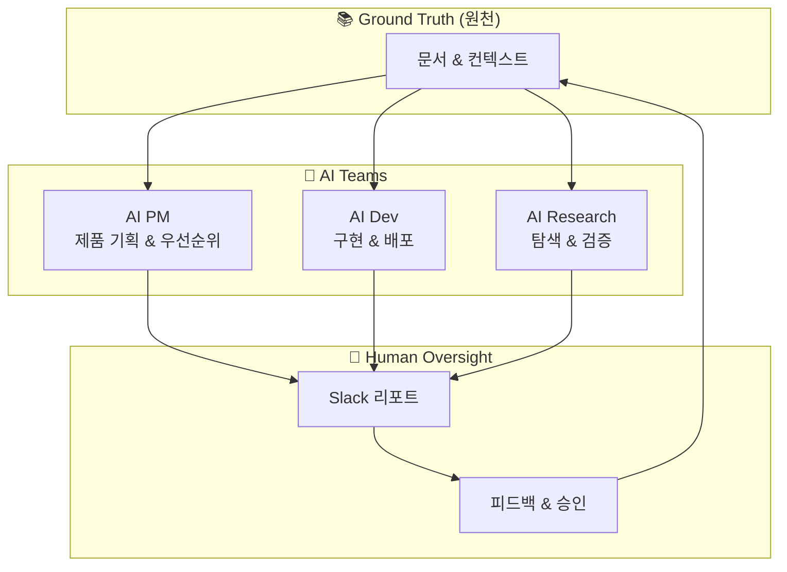
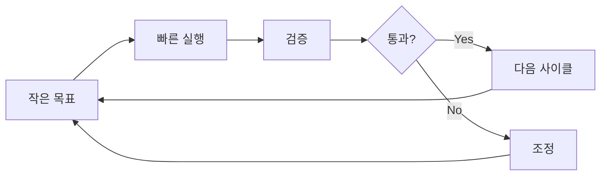
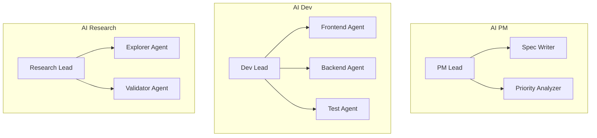
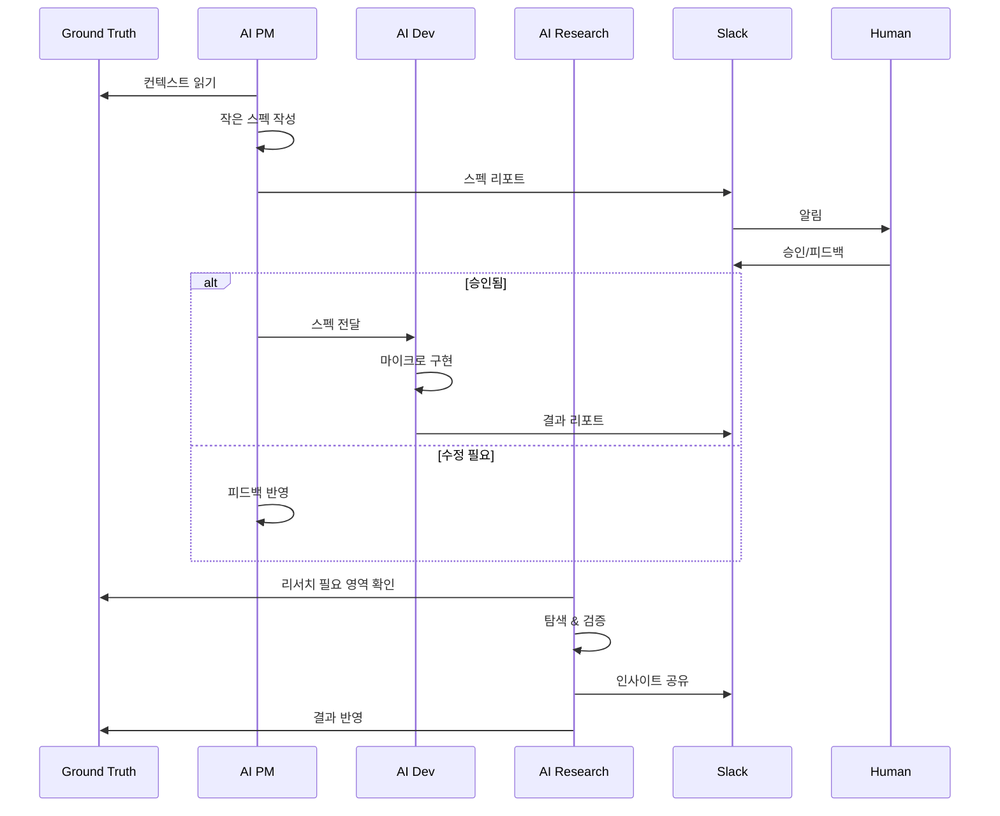

# AI 팀 구조

Ground Truth를 원천으로 하는 AI 팀 구조와 운영 방식.

## 팀 구성

## 핵심 원칙

### 1. 마이크로 사이클

> **가장 작은 검증 가능한 단위로 작업하고, 점진적으로 확장**

**사이클 원칙:**
- 1 사이클 = 1 검증 가능한 결과물
- 인간 검증 필요시 → Slack 리포트 후 대기
- 피드백 반영 후 이어서 진행
- 점진적 확장 (작게 시작 → 크게 성장)

### 2. 위임 구조

각 팀은 세부 작업을 서브 에이전트에게 위임 가능:

### 3. Slack 리포트 프로토콜

인간 검증이 필요한 상황:

| 상황 | 액션 | 대기 |
|------|------|------|
| 중요 결정 | Slack 리포트 + 승인 요청 | 승인까지 대기 |
| 불확실성 | Slack 질문 | 답변까지 대기 |
| 사이클 완료 | Slack 결과 공유 | 대기 없이 진행 |
| 블로커 발생 | Slack 에스컬레이션 | 해결까지 대기 |

## 팀별 역할

| 팀 | 핵심 역할 | 주요 산출물 |
|----|----------|------------|
| [AI PM](./ai-pm) | 제품 방향, 우선순위, 스펙 | PRD, 로드맵, 백로그 |
| [AI Dev](./ai-dev) | 구현, 테스트, 배포 | 코드, 테스트, 문서 |
| [AI Research](./ai-research) | 기술 탐색, 가설 검증 | 리서치 노트, PoC |

## 작업 흐름

---

:::tip 마이크로 사이클의 힘
작은 사이클은 리스크를 줄이고, 빠른 학습을 가능하게 합니다.
- ❌ 2주 개발 후 검증
- ✅ 2시간 개발 → 검증 → 피드백 → 반복
:::
