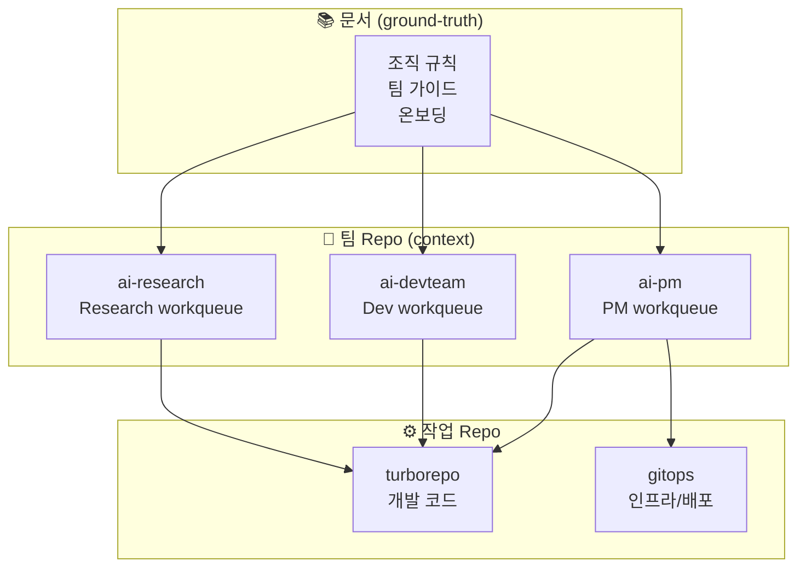
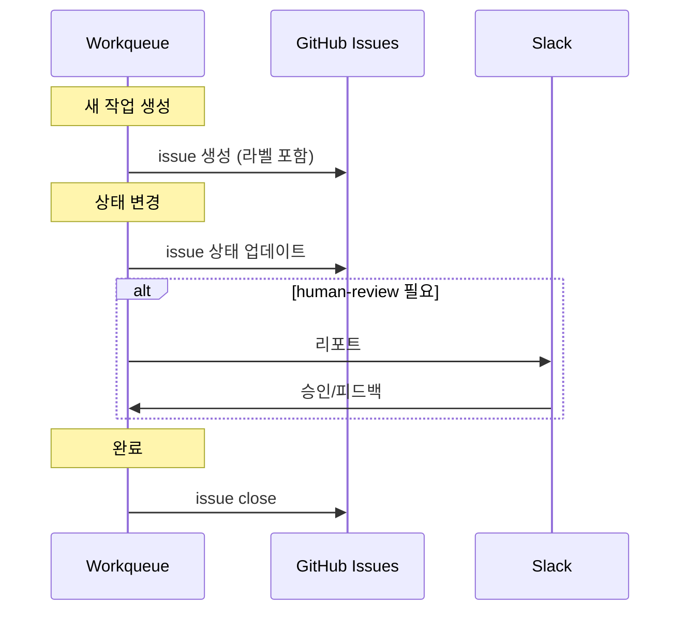

# 팀 Repo 구조

각 AI 팀의 repo 구조와 역할 정의.

## Repo 분리 원칙



## Repo별 역할

| Repo | 목적 | 내용 |
|------|------|------|
| `ground-truth` | 문서 허브 | 조직 규칙, 팀 가이드, 온보딩 |
| `ai-pm` | PM 컨텍스트 | PM workqueue, 스펙 히스토리 |
| `ai-devteam` | Dev 컨텍스트 | Dev workqueue, 구현 히스토리 |
| `ai-research` | Research 컨텍스트 | Research workqueue, 리서치 노트 |
| `turborepo` | 개발 | 실제 코드, 테스트 |
| `gitops` | 인프라 | 배포 설정, IaC |

## 팀 Repo 구조 (표준)

각 팀 repo는 동일한 구조를 따름:

```
ai-{team}/
├── CLAUDE.md              # AI agent 컨텍스트
├── README.md              # 팀 소개
├── workqueue/             # 작업 큐
│   ├── inbox/             # 새 작업
│   ├── in-progress/       # 진행 중
│   ├── blocked/           # 블로커
│   ├── done/              # 완료
│   └── templates/         # 작업 템플릿
├── context/               # 팀 컨텍스트
│   ├── current-focus.md   # 현재 집중 영역
│   ├── decisions.md       # 주요 결정 히스토리
│   └── handoffs.md        # 핸드오프 기록
└── .claude/               # Claude 설정
    ├── skills/            # 팀 스킬
    └── commands/          # 팀 커맨드
```

## CLAUDE.md 템플릿

각 팀 repo의 CLAUDE.md:

```markdown
# {Team} Agent Context

## 역할
{팀 역할 1문장}

## 집중 영역
{현재 가장 중요한 것}

## 규칙
- Ground Truth 규칙 준수
- 마이크로 사이클 (2시간 이내)
- Human 필요시 Slack 리포트

## 시작 시
1. workqueue/inbox 확인
2. context/current-focus.md 확인
3. 가장 우선순위 높은 작업 픽업

## 작업 완료 시
1. workqueue 상태 업데이트
2. GitHub issue 동기화
3. 필요시 Slack 리포트
```

## Workqueue ↔ GitHub Issue 동기화



### 동기화 규칙

| Workqueue | GitHub Issue | 라벨 |
|-----------|--------------|------|
| `inbox/` | Open | `ready` |
| `in-progress/` | Open | `in-progress` |
| `blocked/` | Open | `blocked` |
| `done/` | Closed | - |

## 작업 흐름 예시

### PM이 Dev에게 작업 전달

```bash
# 1. PM repo에서 스펙 작성
# ai-pm/workqueue/done/feature-auth.md

# 2. GitHub issue 생성
gh issue create \
  --repo org-tinysolver/ai-devteam \
  --title "사용자 인증 구현" \
  --label "team:dev,handoff:pm→dev,ready" \
  --body "..."

# 3. Dev repo workqueue에 자동 연동
# ai-devteam/workqueue/inbox/feature-auth.md
```

### Dev가 작업 완료 후

```bash
# 1. 코드는 turborepo에
# turborepo/apps/web/src/auth/...

# 2. workqueue 상태 업데이트
# ai-devteam/workqueue/done/feature-auth.md

# 3. GitHub issue close + PM에게 리뷰 요청
gh issue create \
  --repo org-tinysolver/ai-pm \
  --title "인증 구현 완료 - 리뷰 요청" \
  --label "team:pm,handoff:dev→pm,human-review"
```

---

:::tip 원칙
- **문서**: ground-truth
- **컨텍스트**: 팀 repo
- **코드**: turborepo/gitops
:::
