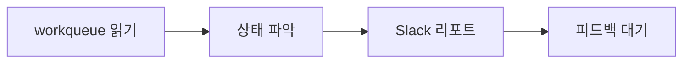

# Workqueue Manager

AI PM의 첫 번째 제품: Workqueue 관리 자동화.

## 문제

workqueue에 작업이 쌓이지만 우선순위 정리, 상태 업데이트가 수동으로 이루어짐.

## 해결

AI PM이 workqueue를 읽고, 정리하고, Slack에 리포트.

## 마이크로 사이클 v0.1



### 최소 기능

1. **읽기**: `workqueue/` 폴더의 모든 `.md` 파일 파싱
2. **상태 파악**: 각 작업의 상태/우선순위 집계
3. **Slack 리포트**: 현재 상태 요약 전송

### 검증 기준

- [ ] workqueue 파일들을 읽을 수 있다
- [ ] 상태별 개수를 집계할 수 있다
- [ ] Slack에 요약 리포트를 보낼 수 있다

## Slack 리포트 형식

```markdown
## 📋 Workqueue 현황

| 상태 | 개수 |
|------|------|
| 대기 | N |
| 진행중 | N |
| 블락 | N |
| 완료 | N |

### 🔴 높음 우선순위
- [작업명](링크)

### 다음 추천 작업
- [작업명] - 이유
```

## 다음 사이클 (v0.2 예정)

- 우선순위 제안
- 작업 상태 자동 업데이트
- 블로커 감지 & 에스컬레이션

---

:::tip 첫 사이클 목표
읽기 → 집계 → 리포트. 이것만 되면 v0.1 성공.
:::
