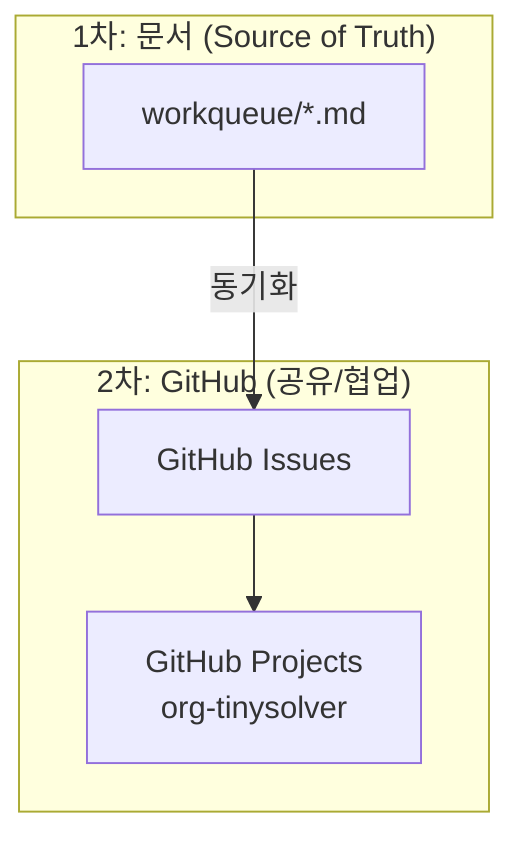

# Workqueue Manager

AI PM의 첫 번째 제품: Workqueue 관리 자동화.

## 2단계 관리 구조

| 단계 | 도구 | 목적 |
|------|------|------|
| 1차 | `workqueue/*.md` | 원천, 상세 정보 |
| 2차 | GitHub Issues/Projects | 공유, 트래킹, 협업 |

## 마이크로 사이클 v0.1

### 최소 기능

1. **읽기**: `workqueue/` 폴더 `.md` 파일 파싱
2. **집계**: 상태/우선순위별 카운트
3. **리포트**: Slack 요약 전송

### 검증 기준

- [ ] workqueue 파일 읽기
- [ ] 상태별 집계
- [ ] Slack 리포트 전송

## v0.2 예정

- GitHub Issue 자동 생성
- Organization Project 연동
- Issue ↔ workqueue 동기화

---

:::tip 원천은 문서
GitHub은 2차 관리. 원천은 항상 `workqueue/*.md`.
:::
