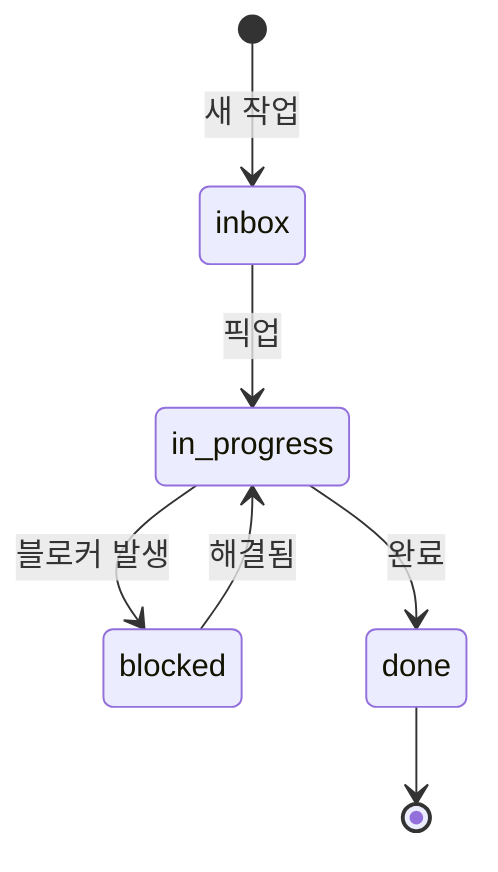

# Workqueue 표준

각 팀 repo에서 사용하는 workqueue 구조와 규칙.

## 디렉토리 구조

```
workqueue/
├── inbox/              # 새 작업 (ready)
├── in-progress/        # 진행 중
├── blocked/            # 블로커 있음
├── done/               # 완료
│   └── 2024-12/       # 월별 아카이브
└── templates/          # 작업 템플릿
    ├── feature.md
    ├── bug.md
    └── research.md
```

## 작업 파일 형식

### 파일명
```
{priority}-{date}-{slug}.md

예시:
1-2024-12-22-user-auth.md      # 높음
2-2024-12-22-api-docs.md       # 중간
3-2024-12-22-refactor.md       # 낮음
```

### 우선순위
| 접두사 | 우선순위 | 설명 |
|--------|----------|------|
| `1-` | 🔴 높음 | 즉시 처리 |
| `2-` | 🟡 중간 | 이번 사이클 |
| `3-` | 🟢 낮음 | 여유 있을 때 |

## 작업 템플릿

### 기본 템플릿

```markdown
# {제목}

## 메타
- **출처**: {handoff:pm→dev | 자체 | issue#123}
- **우선순위**: 🔴 높음 | 🟡 중간 | 🟢 낮음
- **예상 시간**: {N}시간
- **GitHub Issue**: {링크}

## 요약
{1-2문장}

## 컨텍스트
{왜 필요한지}

## 작업 내용
- [ ] 할 일 1
- [ ] 할 일 2

## 완료 조건
{어떻게 되면 끝인지}

## 로그
### {날짜}
- {진행 내용}
```

### PM 스펙 템플릿

```markdown
# {기능명} 스펙

## 메타
- **우선순위**: 🔴 높음 | 🟡 중간 | 🟢 낮음
- **대상 팀**: team:dev | team:research
- **GitHub Issue**: {링크}

## 문제
{1-2문장}

## 가설
{검증하고자 하는 것}

## 범위
- ✅ 포함: {최소 범위}
- ❌ 제외: {명시적 제외}

## 성공 기준
{측정 가능}

## 핸드오프
- [ ] Dev 전달
- [ ] Slack 리포트

## 로그
### {날짜}
- 스펙 초안 작성
```

### Dev 구현 템플릿

```markdown
# {기능명} 구현

## 메타
- **출처**: handoff:pm→dev
- **스펙**: {PM 스펙 링크}
- **GitHub Issue**: {링크}

## 구현 계획
1. {단계 1}
2. {단계 2}

## 체크리스트
- [ ] 스펙 확인
- [ ] 최소 구현
- [ ] 테스트 통과
- [ ] PR 생성

## Human 체크
- [ ] 되돌릴 수 없는 작업? → 승인 필요
- [ ] 프로덕션 영향? → 승인 필요

## 로그
### {날짜}
- 작업 시작
```

### Research 탐색 템플릿

```markdown
# {질문}

## 메타
- **출처**: {pm 요청 | 자체 탐색}
- **예상 시간**: {N}시간
- **GitHub Issue**: {링크}

## 배경
{왜 이 질문이 나왔는지}

## 탐색 범위
- {조사할 것 1}
- {조사할 것 2}

## 발견
{탐색 결과}

## 옵션
| 옵션 | 장점 | 단점 |
|------|------|------|
| A | ... | ... |
| B | ... | ... |

## 추천
{선호 옵션과 이유}

## 로그
### {날짜}
- 탐색 시작
```

## 상태 전이



## GitHub Issue 동기화

### 생성 시
```bash
# workqueue에 파일 생성 후
gh issue create \
  --title "{제목}" \
  --label "team:{team},ready" \
  --body "$(cat workqueue/inbox/{file}.md)"
```

### 상태 변경 시
```bash
# in-progress로 이동
gh issue edit {number} --remove-label "ready" --add-label "in-progress"

# blocked로 이동
gh issue edit {number} --add-label "blocked"

# 완료
gh issue close {number}
```

## 자동화 (향후)

```yaml
# .github/workflows/workqueue-sync.yml
name: Workqueue Sync

on:
  push:
    paths:
      - 'workqueue/**'

jobs:
  sync:
    runs-on: ubuntu-latest
    steps:
      - name: Sync to GitHub Issues
        # workqueue 변경 → issue 동기화
```

---

:::tip 원칙
- 1 작업 = 1 파일 = 1 이슈
- 상태는 디렉토리로 관리
- 로그는 파일 내에 누적
:::
