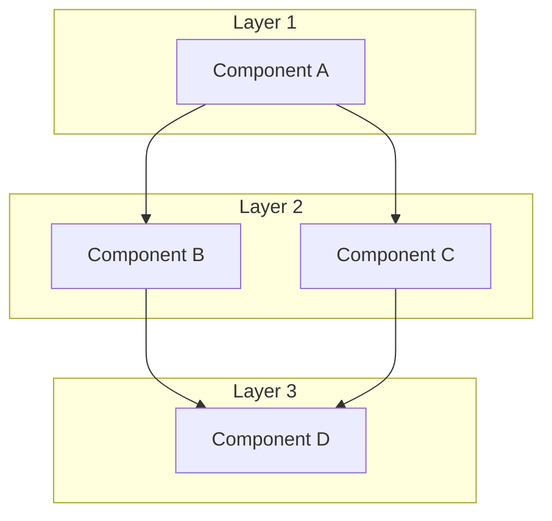
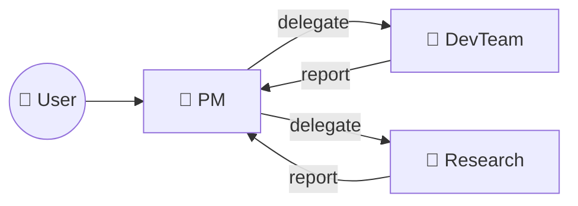
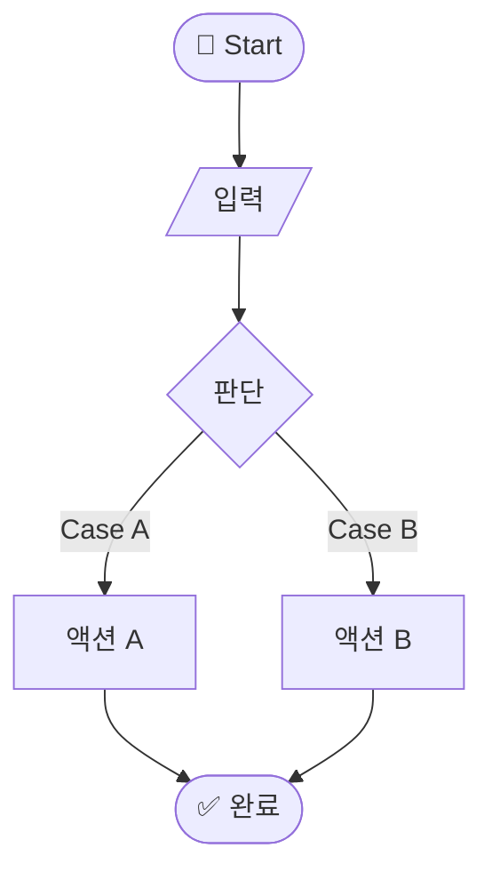
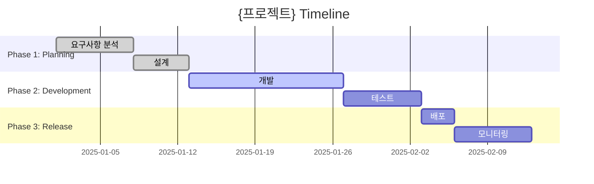
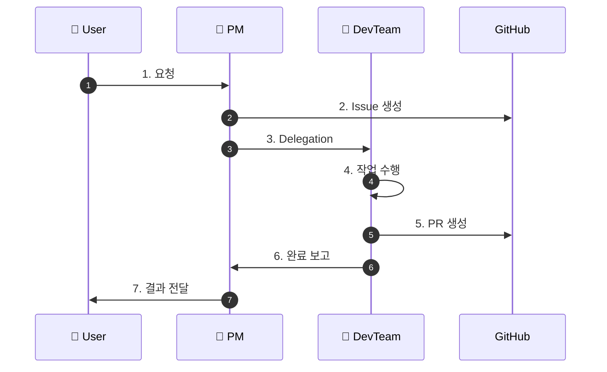

# Diagram Report Template

PM 시각화 문서 작성 시 사용할 템플릿입니다.

---

## 기본 템플릿

```markdown
---
type: ARCH | PROJ | FLOW | SEQ | TEAM | GANTT | SITE | ER
subject: subject-name
date: YYYY-MM-DD
---

# {대상} {다이어그램 타입}

## Overview

{무엇을 시각화했는지 1-2문장}

## Diagram

```mermaid
{다이어그램 코드}
```

## Components

| Component | Description |
|-----------|-------------|
| A | 설명 |
| B | 설명 |

## Notes

- 주요 포인트 1
- 주요 포인트 2

## References

- 관련 문서: ...

---

*Generated by PM AI*
```

---

## 타입별 템플릿

### Architecture (ARCH)

```markdown
---
type: ARCH
subject: {subject-name}
date: YYYY-MM-DD
---

# {대상} Architecture

## Overview

{대상}의 전체 시스템 아키텍처입니다.

## Diagram



## Components

| Layer | Component | Description |
|-------|-----------|-------------|
| 1 | A | ... |
| 2 | B | ... |
| 2 | C | ... |
| 3 | D | ... |

## Data Flow

1. ...
2. ...
```

### Team Interaction (TEAM)

```markdown
---
type: TEAM
subject: {team-name}
date: YYYY-MM-DD
---

# {팀} Interaction

## Overview

{팀}의 상호작용 관계입니다.

## Diagram



## Roles

| Role | Responsibility | Interactions |
|------|----------------|--------------|
| PM | 프로젝트 관리 | User, Dev, Research |
| DevTeam | 개발 수행 | PM |
| Research | 리서치 수행 | PM |

## Communication Channels

- Slack: 실시간 알림
- GitHub: Issue, PR
- Meeting: 정기 회의
```

### Workflow (FLOW)

```markdown
---
type: FLOW
subject: {workflow-name}
date: YYYY-MM-DD
---

# {워크플로우} Flow

## Overview

{워크플로우}의 처리 흐름입니다.

## Diagram



## Steps

| Step | Description | Condition |
|------|-------------|-----------|
| 1 | 입력 | - |
| 2 | 판단 | Case A / Case B |
| 3 | 액션 수행 | - |
| 4 | 완료 | - |
```

### Project Timeline (GANTT)

```markdown
---
type: GANTT
subject: {project-name}
date: YYYY-MM-DD
---

# {프로젝트} Timeline

## Overview

{프로젝트}의 일정 타임라인입니다.

## Diagram



## Milestones

| Phase | Milestone | Target Date | Status |
|-------|-----------|-------------|--------|
| 1 | 설계 완료 | YYYY-MM-DD | ✅ |
| 2 | 개발 완료 | YYYY-MM-DD | 🔄 |
| 3 | 배포 완료 | YYYY-MM-DD | ⬜ |

## Dependencies

- Phase 2는 Phase 1 완료 후 시작
- Phase 3는 Phase 2 완료 후 시작
```

### Sequence (SEQ)

```markdown
---
type: SEQ
subject: {process-name}
date: YYYY-MM-DD
---

# {프로세스} Sequence

## Overview

{프로세스}의 순차 흐름입니다.

## Diagram



## Steps

| # | From | To | Action | Description |
|---|------|-----|--------|-------------|
| 1 | User | PM | 요청 | ... |
| 2 | PM | GitHub | Issue 생성 | ... |
| 3 | PM | DevTeam | Delegation | ... |
| 4 | DevTeam | DevTeam | 작업 수행 | ... |
| 5 | DevTeam | GitHub | PR 생성 | ... |
| 6 | DevTeam | PM | 완료 보고 | ... |
| 7 | PM | User | 결과 전달 | ... |
```

---

## 사용법

1. 해당 타입 템플릿 복사
2. `{}` 안의 내용을 실제 값으로 대체
3. Mermaid 다이어그램 수정
4. `reports/diagrams/YYYY-MM-DD-{subject}-{type}.md` 로 저장
