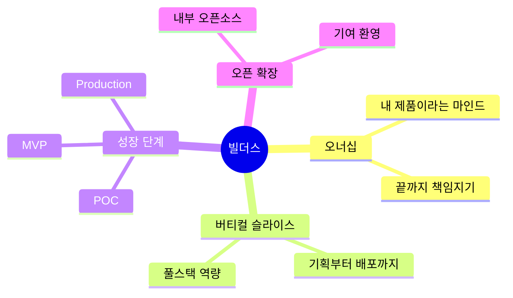
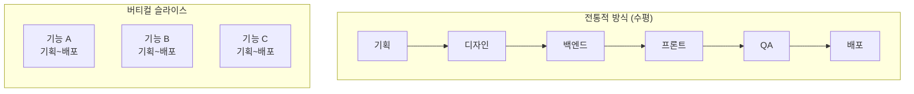

# 빌더스 오버뷰

우리는 **각자가 오너십을 가지고, 혼자서 버티컬 슬라이스로 제품을 만들어가는 문화**를 지향합니다.

## 핵심 가치

## 제품 성장 단계

import { StepGuide } from '@site/src/components/InteractiveDemo';

<StepGuide steps={[
  {
    title: 'POC',
    content: (
      

        <h4>Proof of Concept</h4>
        
<strong>목표:</strong> 아이디어 검증, 기술적 가능성 확인

        <ul>
          <li>빠르게 만들고 빠르게 버리기</li>
          <li>완벽함보다 속도</li>
          <li>핵심 가설 검증에 집중</li>
        </ul>
        
<strong>기간:</strong> 1-2주

      

    )
  },
  {
    title: 'MVP',
    content: (
      

        <h4>Minimum Viable Product</h4>
        
<strong>목표:</strong> 실제 사용자 피드백 수집

        <ul>
          <li>핵심 기능만 구현</li>
          <li>실사용 가능한 수준</li>
          <li>빠른 이터레이션</li>
        </ul>
        
<strong>기간:</strong> 2-4주

      

    )
  },
  {
    title: 'Production',
    content: (
      

        <h4>정식 프로덕션</h4>
        
<strong>목표:</strong> 안정적인 서비스 운영

        <ul>
          <li>프로덕션 레벨 품질</li>
          <li>모니터링 & 알림</li>
          <li>문서화 & 온보딩</li>
        </ul>
        
<strong>기간:</strong> 지속적 개선

      

    )
  },
  {
    title: 'Open',
    content: (
      

        <h4>오픈소스 스타일 확장</h4>
        
<strong>목표:</strong> 팀 전체로 확장

        <ul>
          <li>다른 팀원의 기여 환영</li>
          <li>PR 리뷰 & 머지</li>
          <li>지식 공유 & 전파</li>
        </ul>
        
<strong>방식:</strong> 내부 오픈소스

      

    )
  }
]} />

---

## 버티컬 슬라이스란?

**버티컬 슬라이스 = 하나의 기능을 처음부터 끝까지 혼자서**

- ✅ 기획/설계
- ✅ 백엔드 개발
- ✅ 프론트엔드 개발
- ✅ 테스트
- ✅ 배포
- ✅ 모니터링

---

## 오픈소스 스타일 기여

만들어진 제품은 **내부 오픈소스**처럼 운영됩니다.

### 기여 방법

<!-- TODO: 상세 가이드 -->

1. 저장소 Fork 또는 Branch 생성
2. 변경사항 개발
3. PR 생성 및 리뷰 요청
4. 리뷰 반영 후 머지

---

## 빌더 체크리스트

import Checklist from '@site/src/components/Checklist';

<Checklist items={[
  { id: 'culture', label: '빌더 문화 이해하기' },
  { id: 'vertical', label: '버티컬 슬라이스 개념 파악' },
  { id: 'poc', label: '첫 POC 프로젝트 시작' },
  { id: 'share', label: '팀에 공유하기' },
]} />

