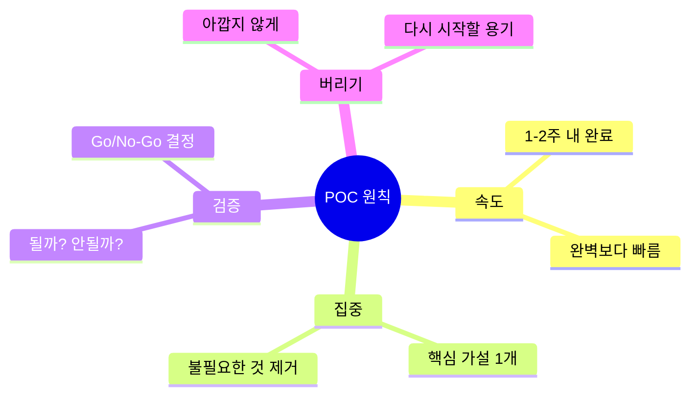

# POC 가이드

Proof of Concept - 아이디어를 빠르게 검증하는 방법

## POC란?

> "완벽한 실패보다 빠른 실패가 낫다"

POC는 아이디어의 **기술적 가능성**과 **비즈니스 가치**를 빠르게 검증하는 단계입니다.

## POC 원칙



## POC 템플릿

### 1. 가설 정의

<!-- TODO: 가설 정의 템플릿 -->

```markdown
## 가설
[무엇]을 하면 [결과]가 될 것이다.

## 검증 방법
- [ ] 검증 항목 1
- [ ] 검증 항목 2

## 성공 기준
- 수치화된 기준
```

### 2. 기술 스택 선택

<!-- TODO: 추천 스택 -->

### 3. 타임박싱

<!-- TODO: 타임박싱 가이드 -->

## POC 체크리스트

import Checklist from '@site/src/components/Checklist';

<Checklist items={[
  { id: 'hypothesis', label: '가설 정의 완료' },
  { id: 'scope', label: '스코프 최소화' },
  { id: 'timebox', label: '타임박스 설정 (1-2주)' },
  { id: 'build', label: '빌드 완료' },
  { id: 'validate', label: '가설 검증 완료' },
  { id: 'decision', label: 'Go/No-Go 결정' },
]} />

