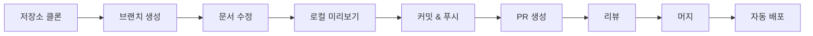
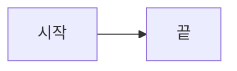
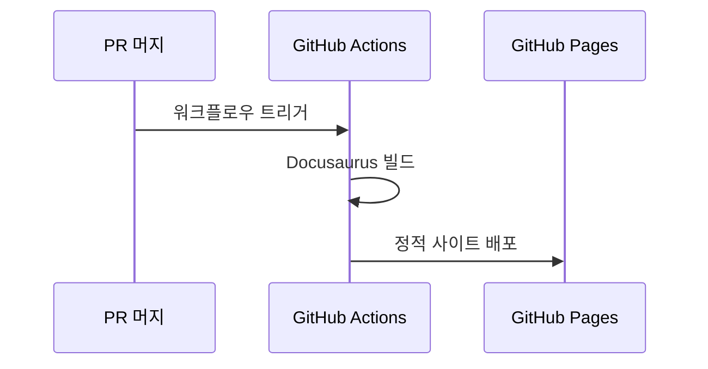

# 📝 문서 기여 가이드

이 온보딩 문서에 기여하는 방법을 안내합니다.

## 기여 프로세스



---

## 1. 환경 설정

### 저장소 클론

```bash
git clone https://github.com/org-tinysolver/ground-truth.git
cd ground-truth
```

### 로컬 미리보기 (Docker 사용)

```bash
# Docker Compose로 실행
docker compose up

# 브라우저에서 확인
open http://localhost:3077
```

### 로컬 미리보기 (Node.js 직접 사용)

```bash
# Node.js 18+ 필요
npm install
npm run start

# 브라우저에서 확인
open http://localhost:3000
```

---

## 2. 문서 수정

### 브랜치 생성

```bash
# main 브랜치에서 시작
git checkout main
git pull origin main

# 새 브랜치 생성
git checkout -b docs/내용-설명
# 예: docs/aws-setup-guide
# 예: docs/fix-typo
```

### Git Worktree로 작업하기 (권장)

:::tip Worktree를 쓰면 좋은 이유
- main 브랜치를 건드리지 않고 별도 폴더에서 작업 가능
- 여러 문서를 동시에 작업할 때 브랜치 전환 없이 각각의 폴더에서 작업
- 작업 중인 내용을 stash 안 해도 됨
:::

```bash
# 1. 먼저 main 최신화
git checkout main
git pull origin main

# 2. worktree로 새 브랜치 생성 (별도 폴더에 생성됨)
git worktree add ../launchpad-docs-aws docs/aws-setup-guide
#                 ↑ 작업할 폴더 경로    ↑ 브랜치 이름

# 3. 해당 폴더로 이동해서 작업
cd ../launchpad-docs-aws

# 4. 로컬 미리보기
docker compose up
# 또는
npm install && npm run start

# 5. 작업 완료 후 커밋 & 푸시
git add .
git commit -m "docs: AWS 설정 가이드 추가"
git push origin docs/aws-setup-guide

# 6. PR 생성 후, worktree 정리
cd ../launchpad
git worktree remove ../launchpad-docs-aws
```

:::note 여러 문서 동시 작업 예시
```bash
# AWS 문서 작업용
git worktree add ../launchpad-aws docs/aws-guide

# GCP 문서 작업용  
git worktree add ../launchpad-gcp docs/gcp-guide

# 각 폴더에서 독립적으로 작업 가능!
```
:::

### 파일 구조

```
docs/
├── intro.mdx              # 메인 페이지
├── products/              # 🚀 프로덕트 문서
├── builders/              # 🔨 빌더스 문서
├── devops/                # 🔧 DevOps 문서
│   └── cloud-setup/       # 클라우드 권한
└── examples.mdx           # 인터랙티브 예제
```

### MDX 문법

일반 Markdown에 React 컴포넌트를 사용할 수 있어요!

#### 기본 Markdown

```markdown
# 제목
## 소제목

**굵게** *기울임* `코드`

- 리스트 1
- 리스트 2

| 표 | 작성 |
|----|------|
| 내용 | 내용 |
```

#### Docusaurus 특수 문법

```markdown
:::note 참고
참고할 내용
:::

:::tip 팁
유용한 팁
:::

:::warning 주의
주의할 내용
:::

:::danger 위험
중요한 경고
:::
```

#### Mermaid 다이어그램

````markdown

````

#### React 컴포넌트 사용

```jsx
import Checklist from '@site/src/components/Checklist';

<Checklist items={[
  { id: 'item1', label: '할 일 1' },
  { id: 'item2', label: '할 일 2' },
]} />
```

---

## 3. 커밋 & 푸시

### 커밋 메시지 컨벤션

```bash
# 형식
<타입>: <설명>

# 타입
docs: 문서 추가/수정
fix: 오타, 링크 수정
feat: 새 기능/컴포넌트 추가
style: 스타일 변경
```

### 예시

```bash
git add docs/devops/cloud-setup/aws-setup.mdx
git commit -m "docs: AWS MFA 설정 가이드 추가"
git push origin docs/aws-setup-guide
```

---

## 4. MR(Merge Request) 생성

## 4. PR(Pull Request) 생성

### GitHub에서 PR 생성

1. GitHub 저장소 페이지로 이동 (`org-tinysolver/ground-truth`)
2. **Pull requests** → **New pull request**
3. base: `main`
4. compare: `docs/aws-setup-guide` (작업한 브랜치)

### MR 제목 & 설명

```markdown
## 제목
docs: AWS MFA 설정 가이드 추가

## 설명
### 변경 사항
- AWS MFA 설정 단계별 가이드 추가
- 스크린샷 첨부

### 체크리스트
- [ ] 로컬에서 미리보기 확인
- [ ] 링크 정상 작동 확인
- [ ] 오타 검수
```

---

## 5. 리뷰 & 머지

### 리뷰 프로세스

1. **빌드 테스트**: MR 생성 시 자동으로 빌드 테스트 실행
2. **리뷰어 지정**: 팀원에게 리뷰 요청
3. **피드백 반영**: 리뷰 코멘트 반영 후 재푸시
4. **머지**: 승인 후 머지

### 머지 후 자동 배포



---

## 빠른 수정 가이드

### 오타 수정

1. 해당 파일 찾기
2. 브랜치 생성: `git checkout -b docs/fix-typo`
3. 수정 후 커밋: `git commit -m "fix: 오타 수정"`
4. PR 생성

### 새 문서 추가

1. 적절한 폴더에 `.mdx` 파일 생성
2. frontmatter 추가:
   ```yaml
   ---
   sidebar_position: 5
   ---
   ```
3. `sidebars.js`에 추가 (필요시)
4. MR 생성

---

## 도움이 필요하면?

import { Accordion } from '@site/src/components/InteractiveDemo';

<Accordion title="MDX 문법이 어려워요">
  일반 Markdown으로 작성해도 됩니다! 특수 기능은 나중에 추가할 수 있어요.
</Accordion>

<Accordion title="어디에 문서를 추가해야 할지 모르겠어요">
  `workqueue/todo.md`를 확인하거나, MR에 질문을 남겨주세요.
</Accordion>

<Accordion title="빌드가 실패해요">
  GitHub Actions 워크플로우 로그를 확인하세요. 대부분 문법 오류입니다.
</Accordion>

---

## 체크리스트

import Checklist from '@site/src/components/Checklist';

<Checklist items={[
  { id: 'clone', label: '저장소 클론' },
  { id: 'branch', label: '브랜치 생성' },
  { id: 'edit', label: '문서 수정' },
  { id: 'preview', label: '로컬 미리보기 확인' },
  { id: 'commit', label: '커밋 & 푸시' },
  { id: 'mr', label: 'PR 생성' },
  { id: 'review', label: '리뷰 받기' },
  { id: 'merge', label: '머지 완료!' },
]} />

