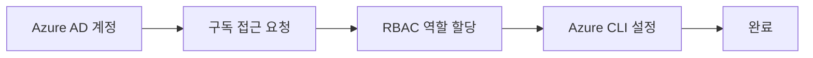

# Azure 권한 신청 가이드

<span className="cloud-badge azure">Azure</span>

Microsoft Azure 계정 및 권한 신청 가이드입니다.

## 신청 프로세스



## Step 1: Azure AD 계정 확인

<!-- TODO: Azure AD 계정 연동 가이드 -->

:::note 계정 정보
회사 Microsoft 365 계정을 사용합니다.
:::

## Step 2: 구독(Subscription) 접근 요청

<!-- TODO: 구독 접근 요청 방법 -->

### 접근 가능 구독 목록

| 구독 이름 | 용도 | 담당자 |
|----------|------|--------|
| | | |
| | | |

## Step 3: RBAC 역할 할당

<!-- TODO: 역할별 RBAC 정책 -->

### 기본 역할

- `Reader` - 읽기 전용
- `Contributor` - 기여자
- `Owner` - 소유자

## Step 4: Azure CLI 설정

```bash
# Azure CLI 로그인
az login

# 구독 설정
az account set --subscription "[SUBSCRIPTION_NAME]"
```

## 문제 해결

:::danger 권한 오류 발생 시
<!-- TODO: 일반적인 오류 및 해결 방법 -->
:::

## 관련 리소스

<!-- TODO: 관련 문서 링크 -->
- 링크 1
- 링크 2

