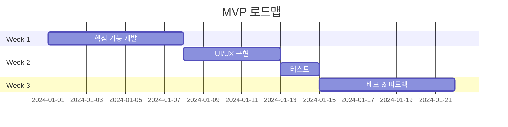

# MVP 가이드

Minimum Viable Product - 실제 사용자와 함께 성장하기

## MVP란?

> "고객이 쓸 수 있는 가장 작은 제품"

POC에서 가설이 검증되면, 실제 사용자가 사용할 수 있는 최소한의 제품을 만듭니다.

## POC vs MVP

| 구분 | POC | MVP |
|------|-----|-----|
| 목적 | 기술 검증 | 시장 검증 |
| 사용자 | 내부 | 실제 사용자 |
| 품질 | 실험적 | 사용 가능 |
| 기간 | 1-2주 | 2-4주 |

## MVP 핵심 원칙

<!-- TODO: 상세 원칙 -->

1. **최소 기능만** - 핵심 가치 하나에 집중
2. **빠른 출시** - 완벽함보다 속도
3. **피드백 루프** - 출시 → 피드백 → 개선

## MVP 로드맵 템플릿

## MVP 체크리스트

import Checklist from '@site/src/components/Checklist';

<Checklist items={[
  { id: 'core', label: '핵심 기능 정의' },
  { id: 'build', label: '기능 개발 완료' },
  { id: 'deploy', label: '배포 완료' },
  { id: 'user', label: '첫 사용자 확보' },
  { id: 'feedback', label: '피드백 수집' },
  { id: 'iterate', label: '개선 사항 반영' },
]} />

