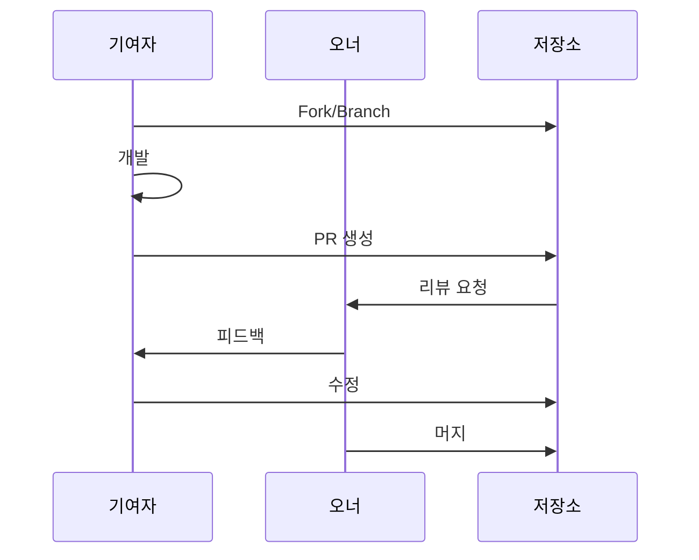

# 오픈 기여 가이드

내부 오픈소스 스타일로 제품을 확장하는 방법

## 오픈 기여란?

만들어진 제품을 팀 전체에 공개하고, 누구나 기여할 수 있도록 하는 문화입니다.


## 오픈 기여 프로세스

### 1. 공개 준비

<!-- TODO: 공개 전 체크리스트 -->

- [ ] README 작성
- [ ] CONTRIBUTING 가이드
- [ ] 이슈 템플릿
- [ ] PR 템플릿

### 2. 기여 받기



### 3. 커뮤니케이션

<!-- TODO: 커뮤니케이션 채널 -->

## CONTRIBUTING.md 템플릿

```markdown
# 기여 가이드

## 시작하기

1. 저장소 Fork
2. 로컬 클론
3. 브랜치 생성
4. 개발
5. PR 생성

## 코드 스타일

<!-- 프로젝트별 스타일 가이드 -->

## 커밋 메시지

<!-- 커밋 컨벤션 -->

## 리뷰 프로세스

<!-- 리뷰 기준 -->
```

## 좋은 기여자 되기

import { Accordion } from '@site/src/components/InteractiveDemo';

<Accordion title="이슈 먼저 확인하기" defaultOpen={true}>
  작업 전에 기존 이슈를 확인하고, 중복 작업을 피하세요.
</Accordion>

<Accordion title="작은 단위로 PR 만들기">
  큰 PR보다 작은 PR이 리뷰하기 쉽습니다. 기능 단위로 나눠서 올려주세요.
</Accordion>

<Accordion title="테스트 포함하기">
  가능하면 테스트 코드를 함께 작성해주세요.
</Accordion>

<Accordion title="문서 업데이트">
  기능 변경 시 관련 문서도 함께 업데이트해주세요.
</Accordion>

## 오픈 기여 체크리스트

import Checklist from '@site/src/components/Checklist';

<Checklist items={[
  { id: 'readme', label: 'README 작성' },
  { id: 'contributing', label: 'CONTRIBUTING 가이드 작성' },
  { id: 'announce', label: '팀에 공개 공지' },
  { id: 'first-pr', label: '첫 외부 PR 머지' },
]} />

