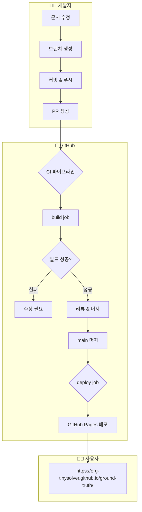
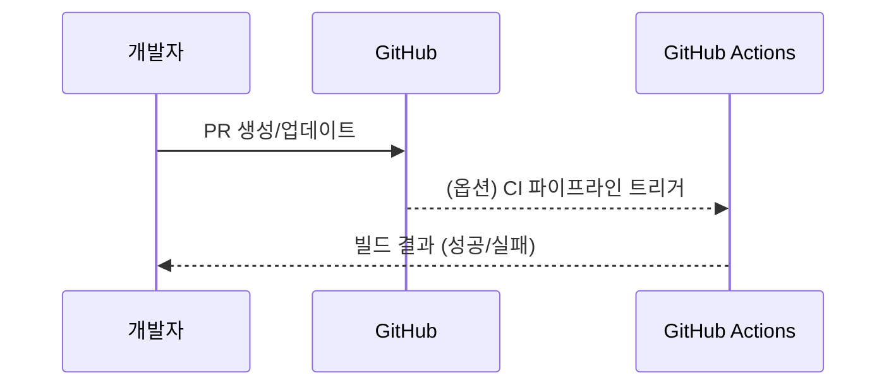
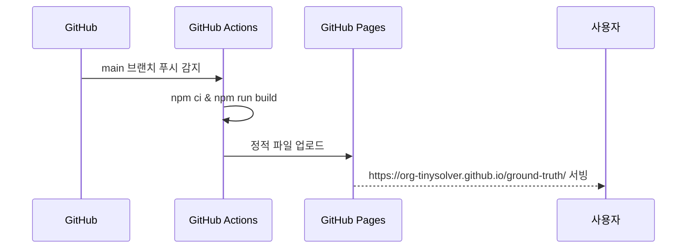

# 🚀 CI/CD 파이프라인

이 문서 사이트가 **GitHub Actions + GitHub Pages**로 어떻게 자동 빌드/배포되는지 설명합니다.

## 전체 아키텍처



---

## 파이프라인 상세

### 1️⃣ PR 생성/업데이트 시 (검증)

> 현재 워크플로우는 **main 머지 기준으로만 빌드/배포**하지만, 향후 PR 기반 빌드가 추가될 수 있습니다.  
> 여기서는 개념적으로 PR → 빌드 → 리뷰 → 머지 플로우를 설명합니다.



**역할:**
- PR은 코드 리뷰와 변경 내역 논의를 위한 단위
- CI가 붙으면 PR에서 빌드 에러를 조기에 발견 가능

### 2️⃣ main 브랜치 머지 시 (실제 배포)



**실행 조건:**
- `main` 브랜치에 푸시 (보통 PR 머지)
- 다음 파일 중 하나 이상 변경:
  - `docs/**`, `src/**`, `static/**`
  - `docusaurus.config.js`, `sidebars.js`, `package.json`

**실행 내용:**
1. **build job**: Docusaurus 정적 사이트 빌드
2. **deploy job**: GitHub Pages로 정적 파일 배포

---

## 파일 구조

```
ground-truth/
├── .github/workflows/deploy.yml  # GitHub Actions 워크플로우
├── docker-compose.yml            # 로컬 개발용 (선택)
├── Dockerfile                    # 로컬/테스트용 컨테이너 빌드
├── docusaurus.config.js          # Docusaurus 설정
└── docs/, src/, static/          # 문서 및 컴포넌트
```

### docker-compose.yml (로컬 개발)

```yaml
services:
  docusaurus:
    build:
      context: .
      dockerfile: Dockerfile
    ports:
      - "3077:3000"
    volumes:
      - ./docs:/app/docs  # 핫 리로드
```

### Dockerfile

현재는 주로 **로컬에서 컨테이너로 띄워보기 위한 용도**로 사용합니다.

```dockerfile
FROM node:20-alpine
WORKDIR /app
COPY package*.json ./
RUN npm ci
COPY . .
RUN npm run build

CMD ["npm", "run", "serve"]
```

---

## GitHub Actions 설정

GitHub Actions 워크플로우는 `.github/workflows/deploy.yml`에 정의되어 있습니다.

```yaml
name: Deploy to GitHub Pages

on:
  push:
    branches:
      - main
    paths:
      - 'docs/**'
      - 'src/**'
      - 'static/**'
      - 'package.json'
      - 'docusaurus.config.js'
      - 'sidebars.js'
  workflow_dispatch:
```

### 주요 Job

- `build` job
  - Node 18 설정
  - `npm ci`
  - `npm run build`
  - Pages artifact 업로드
- `deploy` job
  - GitHub Pages에 artifact 배포
  - 배포 완료 후 Slack Webhook으로 알림

---

## 트러블슈팅

import { Accordion } from '@site/src/components/InteractiveDemo';

<Accordion title="빌드가 실패해요" defaultOpen={true}>
  **원인**: 문법 오류, 의존성 문제
  
  **해결**:
  1. 로컬에서 `npm run build` 실행
  2. GitHub Actions → 해당 워크플로우 실행 로그 확인
  3. 에러 메시지 기준으로 MDX 문법/의존성 수정
</Accordion>

<Accordion title="배포는 성공했는데 화면이 깨져요">
  **원인**: `baseUrl`, 링크 경로, 정적 리소스 경로 문제
  
  **해결**:
  1. `docusaurus.config.js`의 `url` / `baseUrl` 확인  
  2. 절대 경로(`/...`) 대신 상대 경로를 사용하는지 확인  
  3. GitHub Pages 캐시 문제 시, 브라우저 캐시 삭제 후 재시도
</Accordion>

<Accordion title="Slack 알림이 안 와요">
  **원인**: `SLACK_WEBHOOK_URL` Secret 미설정 또는 권한 문제
  
  **해결**:
  1. GitHub → Settings → Secrets and variables → Actions  
  2. `SLACK_WEBHOOK_URL`가 올바르게 설정됐는지 확인  
  3. Webhook URL이 만료되었는지 확인
</Accordion>

---

## 요약


**핵심 포인트:**
1. ✅ PR 기반 워크플로우 (직접 main 푸시 지양)
2. ✅ main 머지 시 GitHub Actions로 자동 빌드/배포
3. ✅ 결과는 GitHub Pages (`https://org-tinysolver.github.io/ground-truth/`)로 노출
4. ✅ 배포 성공 시 Slack 알림으로 빠른 확인

