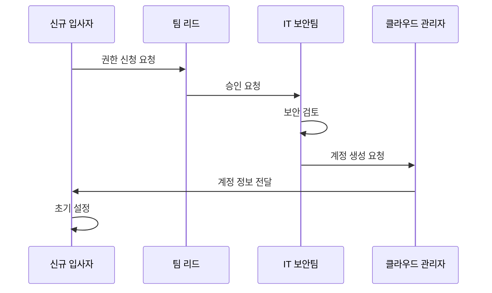

# 클라우드 권한 획득 개요

3사 클라우드(AWS, GCP, Azure) 사용을 위한 신청 및 권한 획득 프로세스 개요입니다.

## 전체 프로세스 다이어그램

## 클라우드별 권한 신청 현황

import CloudStatus from '@site/src/components/CloudStatus';

<CloudStatus />

## 필수 사전 준비

:::info 신청 전 확인사항
<!-- TODO: 사전 준비 항목 작성 -->
- [ ] 항목 1
- [ ] 항목 2
- [ ] 항목 3
:::

## 다음 단계

각 클라우드별 상세 가이드를 확인하세요:

- [AWS 권한 신청](./aws-setup)
- [GCP 권한 신청](./gcp-setup)
- [Azure 권한 신청](./azure-setup)

