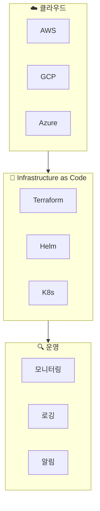

# DevOps 오버뷰

인프라 프로비저닝, 클라우드 관리, 모니터링 & 운영 가이드입니다.

## DevOps 영역

## 온보딩 로드맵

import { StepGuide } from '@site/src/components/InteractiveDemo';

<StepGuide steps={[
  {
    title: '클라우드 권한',
    content: (
      

        <h4>3사 클라우드 권한 획득</h4>
        <ul>
          <li>AWS IAM 계정</li>
          <li>GCP IAM 권한</li>
          <li>Azure RBAC</li>
        </ul>
        <a href="./cloud-setup/overview">→ 클라우드 권한 가이드</a>
      

    )
  },
  {
    title: 'CLI 설정',
    content: (
      

        <h4>로컬 CLI 환경 구성</h4>
        <ul>
          <li>aws-cli</li>
          <li>gcloud</li>
          <li>az</li>
          <li>kubectl</li>
        </ul>
      

    )
  },
  {
    title: 'IaC 이해',
    content: (
      

        <h4>Infrastructure as Code</h4>
        <ul>
          <li>Terraform 기초</li>
          <li>Helm Charts</li>
          <li>Kubernetes 리소스</li>
        </ul>
      

    )
  },
  {
    title: '모니터링',
    content: (
      

        <h4>시스템 가시성</h4>
        <ul>
          <li>메트릭 수집</li>
          <li>로그 조회</li>
          <li>알림 설정</li>
        </ul>
      

    )
  }
]} />

---

## 주요 도구

| 도구 | 용도 | 문서 |
|------|------|------|
| Terraform | IaC | <!-- TODO --> |
| Helm | K8s 패키지 관리 | <!-- TODO --> |
| kubectl | K8s CLI | <!-- TODO --> |
| ArgoCD | GitOps | <!-- TODO --> |

---

## DevOps 체크리스트

import Checklist from '@site/src/components/Checklist';

<Checklist items={[
  { id: 'cloud', label: '클라우드 권한 획득 (AWS, GCP, Azure)' },
  { id: 'cli', label: 'CLI 도구 설치 및 설정' },
  { id: 'kubectl', label: 'kubectl 클러스터 접근' },
  { id: 'terraform', label: 'Terraform 기본 이해' },
  { id: 'monitoring', label: '모니터링 대시보드 접근' },
]} />

---

## 빠른 링크

- [클라우드 권한 획득](./cloud-setup/overview)
- [AWS 셋업](./cloud-setup/aws-setup)
- [GCP 셋업](./cloud-setup/gcp-setup)
- [Azure 셋업](./cloud-setup/azure-setup)

