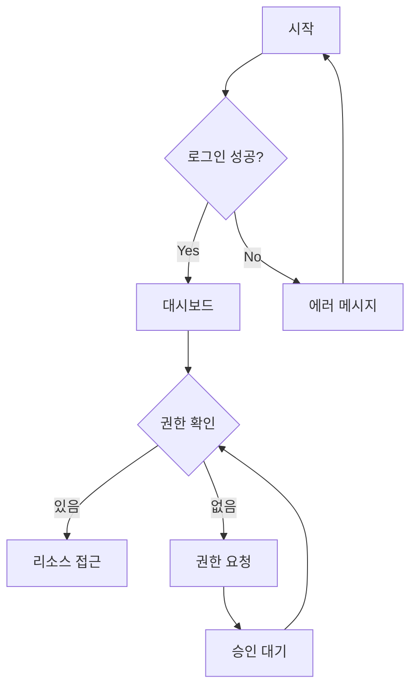
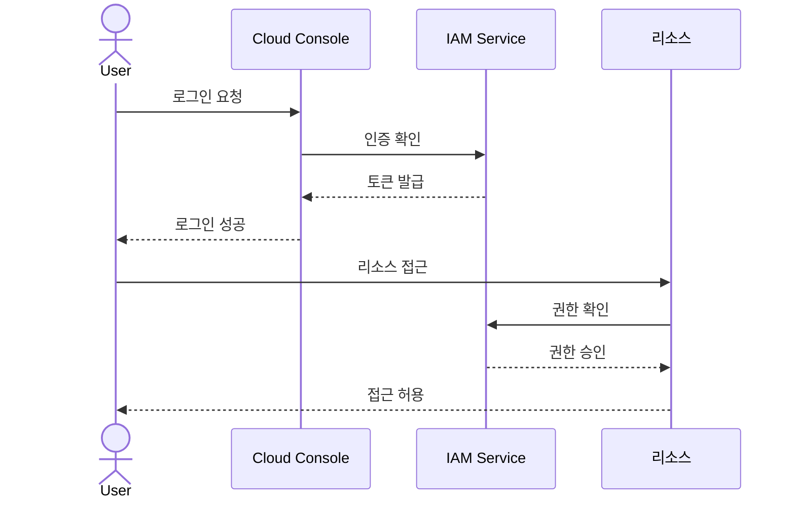
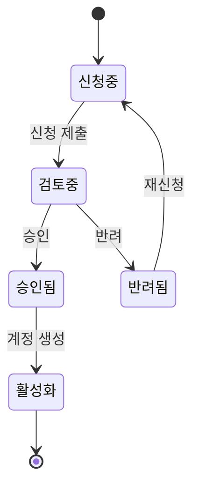

# 🎮 인터랙티브 예제

이 페이지는 MDX에서 사용 가능한 인터랙티브 컴포넌트들을 보여줍니다.

import { Tabs, Accordion, Quiz, StepGuide, Counter, Toggle } from '@site/src/components/InteractiveDemo';
import Checklist from '@site/src/components/Checklist';

---

## 🔢 카운터

간단한 상태 관리 예제:

<Counter />

---

## 🔘 토글 스위치

<div style={{ display: 'flex', flexDirection: 'column', gap: '1rem' }}>
  <Toggle label="다크 모드" />
  <Toggle label="알림 활성화" />
  <Toggle label="자동 저장" />
</div>

---

## 📑 탭 컴포넌트

<Tabs labels={['AWS', 'GCP', 'Azure']}>
  <div>
    <h4>Amazon Web Services</h4>
    <p>AWS는 가장 넓은 서비스 범위를 제공합니다.</p>
    
```bash
aws configure
aws s3 ls
```
  </div>
  <div>
    <h4>Google Cloud Platform</h4>
    <p>GCP는 강력한 데이터 분석 도구를 제공합니다.</p>
    
```bash
gcloud init
gcloud compute instances list
```
  </div>
  <div>
    <h4>Microsoft Azure</h4>
    <p>Azure는 기업 환경에 최적화되어 있습니다.</p>
    
```bash
az login
az vm list
```
  </div>
</Tabs>

---

## 📂 아코디언

<Accordion title="IAM이란 무엇인가요?" defaultOpen={true}>
  Identity and Access Management의 약자로, 클라우드 리소스에 대한 접근 권한을 관리하는 서비스입니다.
  
  - **사용자(User)**: 개별 계정
  - **그룹(Group)**: 사용자 모음
  - **역할(Role)**: 임시 권한 부여
  - **정책(Policy)**: 권한 정의
</Accordion>

<Accordion title="MFA는 왜 필요한가요?">
  Multi-Factor Authentication은 보안을 강화하는 필수 요소입니다.
  
  1. 비밀번호가 유출되어도 추가 인증 필요
  2. 규정 준수 요구사항
  3. 중요 리소스 보호
</Accordion>

<Accordion title="CLI 설정 방법">
  각 클라우드별 CLI 설정 방법입니다:
  
```bash
# AWS
aws configure

# GCP  
gcloud init

# Azure
az login
```
</Accordion>

---

## 🧠 퀴즈

<Quiz 
  question="AWS에서 리소스 접근 권한을 관리하는 서비스는?"
  options={[
    'EC2',
    'S3',
    'IAM',
    'VPC'
  ]}
  correctIndex={2}
  explanation="IAM (Identity and Access Management)은 AWS 리소스에 대한 접근을 안전하게 제어하는 서비스입니다."
/>

<Quiz 
  question="GCP에서 프로젝트 수준의 권한을 관리하는 것은?"
  options={[
    'Cloud Storage',
    'IAM & Admin',
    'Compute Engine',
    'BigQuery'
  ]}
  correctIndex={1}
  explanation="IAM & Admin에서 프로젝트의 역할과 권한을 관리할 수 있습니다."
/>

---

## 📋 스텝 가이드

<StepGuide steps={[
  {
    title: '신청',
    content: (
      <div>
        <p>권한 신청서를 작성하고 제출합니다.</p>
        <ul>
          <li>필요한 권한 수준 선택</li>
          <li>사용 목적 명시</li>
          <li>팀 리드 승인 요청</li>
        </ul>
      </div>
    )
  },
  {
    title: '검토',
    content: (
      <div>
        <p>IT 보안팀에서 신청 내용을 검토합니다.</p>
        <ul>
          <li>보안 정책 준수 확인</li>
          <li>최소 권한 원칙 검토</li>
          <li>필요시 추가 정보 요청</li>
        </ul>
      </div>
    )
  },
  {
    title: '승인',
    content: (
      <div>
        <p>승인이 완료되면 계정이 생성됩니다.</p>
        <ul>
          <li>이메일로 계정 정보 수신</li>
          <li>임시 비밀번호 설정</li>
          <li>MFA 등록 필수</li>
        </ul>
      </div>
    )
  },
  {
    title: '설정',
    content: (
      <div>
        <p>로컬 환경에 CLI를 설정합니다.</p>
        <ul>
          <li>CLI 도구 설치</li>
          <li>자격 증명 구성</li>
          <li>연결 테스트</li>
        </ul>
      </div>
    )
  },
  {
    title: '완료',
    content: (
      <div>
        <p>🎉 모든 설정이 완료되었습니다!</p>
        <p>이제 클라우드 리소스를 사용할 수 있습니다.</p>
      </div>
    )
  }
]} />

---

## ✅ 체크리스트

<Checklist items={[
  { id: 'read-doc', label: '문서 읽기 완료' },
  { id: 'quiz-done', label: '퀴즈 완료' },
  { id: 'understand', label: '내용 이해 완료' },
  { id: 'ready', label: '실습 준비 완료' },
]} />

---

## 📊 Mermaid 다이어그램

### 플로우차트



### 시퀀스 다이어그램



### 상태 다이어그램



---

## 💡 사용법

이 컴포넌트들을 다른 MDX 문서에서 사용하려면:

```jsx
import { Tabs, Accordion, Quiz, StepGuide } from '@site/src/components/InteractiveDemo';

<Quiz 
  question="질문"
  options={['옵션1', '옵션2', '옵션3']}
  correctIndex={0}
  explanation="설명"
/>
```

