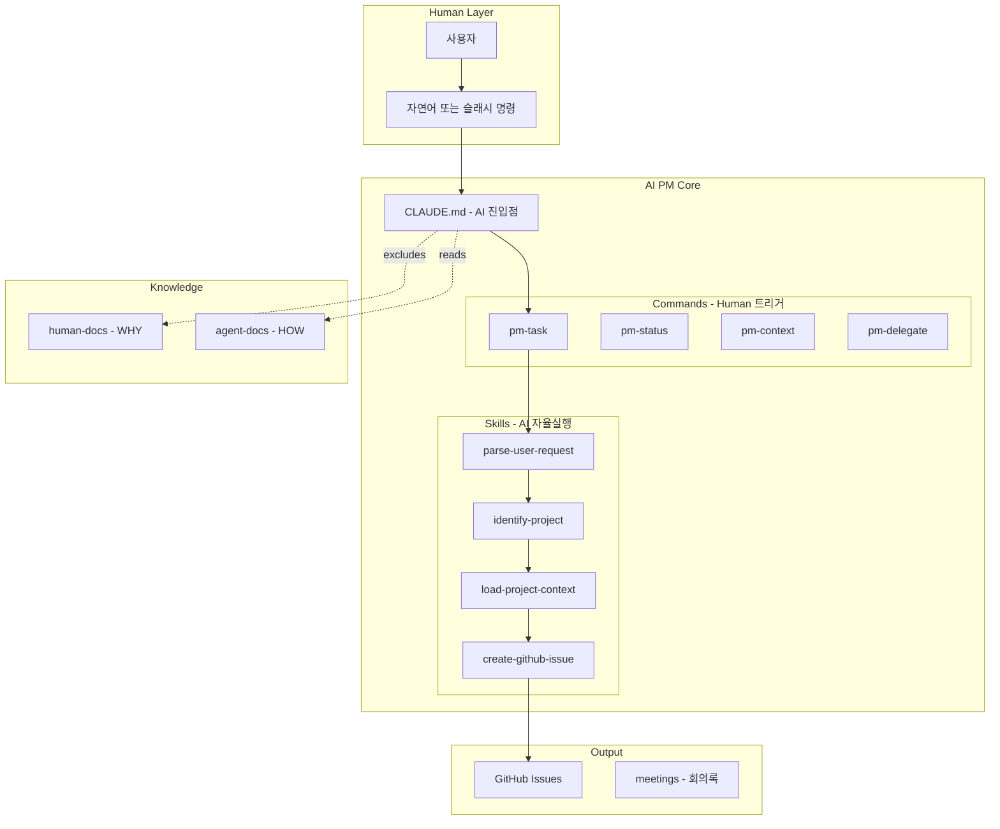
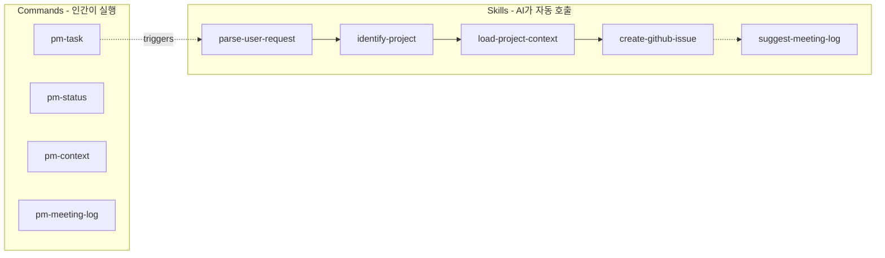
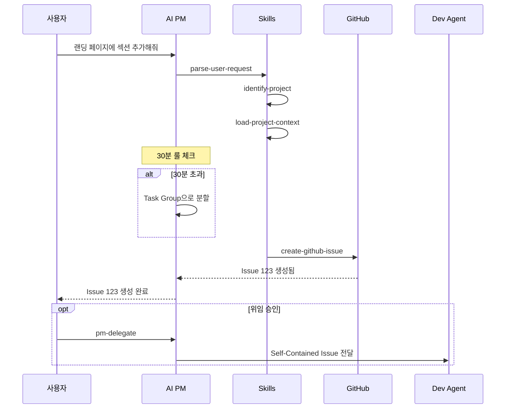
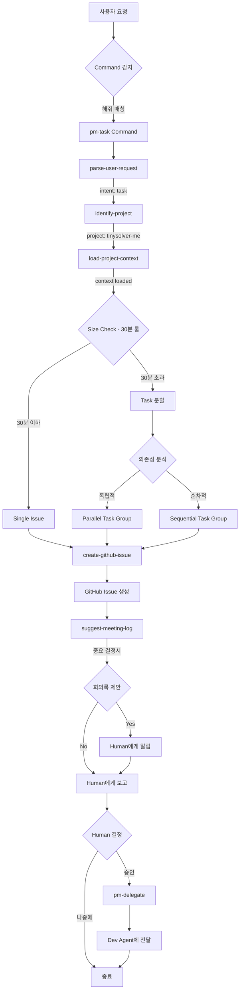
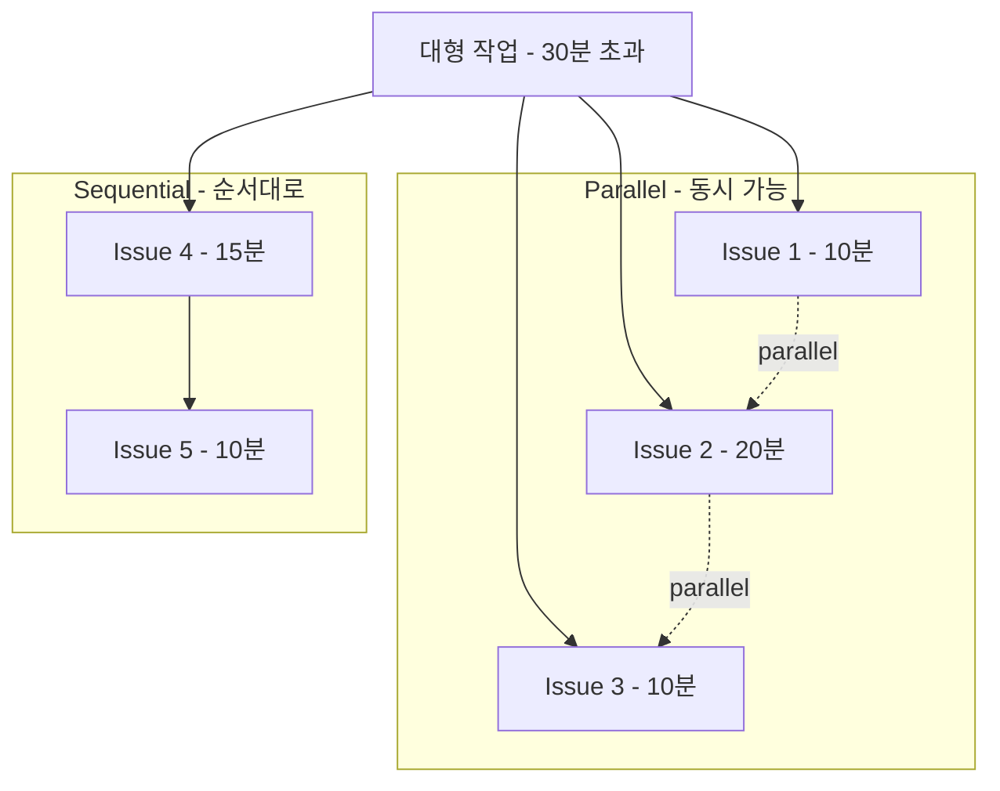
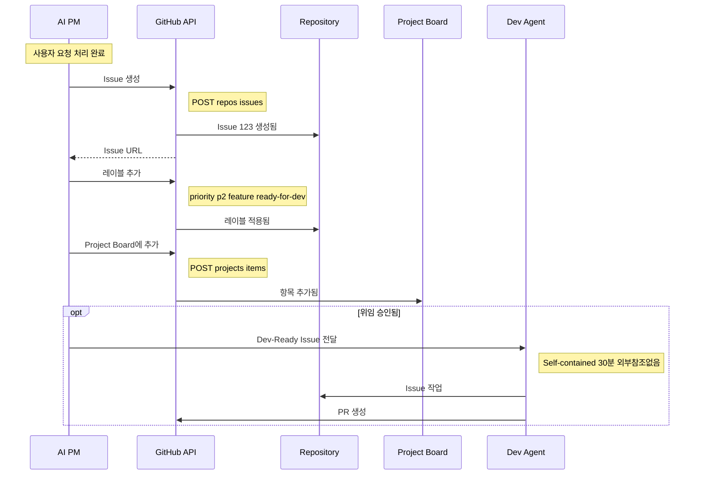

# AI-PM 시스템 오버뷰

이 문서는 AI-PM 레포지토리의 동작 방식을 한눈에 파악할 수 있도록 정리한 오버뷰입니다.

---

## 목차

1. [핵심 아키텍처](#핵심-아키텍처)
2. [디렉토리 구조](#디렉토리-구조)
3. [Commands vs Skills](#commands-vs-skills)
4. [작업 처리 흐름](#작업-처리-흐름)
5. [핵심 원칙](#핵심-원칙)
6. [Task Group 시스템](#task-group-시스템)
7. [GitHub 연동](#github-연동)
8. [주요 파일 참조](#주요-파일-참조)

---

## 핵심 아키텍처



---

## 디렉토리 구조

```
ai-pm/
├── CLAUDE.md                  # AI 진입점 (Claude Code 자동 로드)
├── README.md                  # 인간용 빠른 시작 가이드
├── OVERVIEW.md                # 이 파일 - 시스템 오버뷰
├── HISTORY.md                 # 개발 진행 로그
├── .claudeignore              # human-docs/ AI context 제외
│
├── .claude/                   # Claude Code 통합
│   ├── commands/             # 👤 Human Commands (명시적 트리거)
│   │   ├── core/             # 핵심 PM 기능
│   │   │   ├── pm-task.md
│   │   │   ├── pm-status.md
│   │   │   ├── pm-context.md
│   │   │   └── pm-delegate.md
│   │   ├── planning/         # 계획 관련
│   │   │   └── pm-new-idea.md
│   │   └── reporting/        # 리포팅/문서화
│   │       ├── pm-export.md
│   │       └── pm-meeting-log.md
│   │
│   └── skills/               # 🤖 AI Skills (자율 실행)
│       ├── information/      # 정보 수집
│       ├── status/           # 상태 조회
│       ├── documentation/    # 문서화
│       └── github/           # GitHub 연동
│
├── human-docs/               # 🔴 인간 전용 (Source of Truth - WHY)
│   ├── standards/           # 조직 표준
│   ├── decisions/           # ADR (Architecture Decision Records)
│   ├── principles/          # 핵심 가치 & 철학
│   └── guides/              # 상세 가이드
│
├── agent-docs/              # 🟢 AI 참조 (HOW)
│   ├── rules/              # AI가 따라야 할 규칙
│   ├── templates/          # AI가 사용하는 템플릿
│   └── schemas/            # 데이터 구조 정의
│
├── meetings/                # 회의록 (AI 세션 기록)
│   ├── YYYY-MM/            # 월별 폴더
│   └── README.md           # 회의록 인덱스
│
├── objectives/              # OKR 추적 (분기별)
│   └── YYYY-QN/            # 분기 폴더
│
├── projects/                # 관리 대상 프로젝트 설정
│   └── project-name/
│       └── project.yaml    # 프로젝트 설정
│
└── workflows/               # 자동화 워크플로우
    ├── n8n/                # n8n 워크플로우
    └── prefect/            # Python Prefect 플로우
```

---

## Commands vs Skills

### Human Commands (👤 인간이 실행)

인간이 명시적으로 실행하거나 자연어로 요청하는 명령어입니다.

| Command | 자연어 트리거 | 설명 |
|---------|-------------|------|
| `/pm-task` | "~해줘", "만들어줘" | 태스크 생성/관리 |
| `/pm-status` | "현황", "어떻게 됐어?" | 현황 조회 |
| `/pm-context` | "뭐 하고 있었지?" | 빠른 현황 파악 |
| `/pm-delegate` | "구현해줘" | Dev Agent 위임 |
| `/pm-new-idea` | "새 프로젝트", "아이디어" | 새 아이디어 구조화 |
| `/pm-meeting-log` | "기록해줘", "회의록" | 회의록 작성 |
| `/pm-export` | "정리해줘", "export" | 발표/보고용 export |

### AI Skills (🤖 AI가 자율 실행)

AI가 Command 실행 중 필요에 따라 자동으로 호출하는 스킬입니다.

| Category | Skills | 용도 |
|----------|--------|------|
| **Information** | `parse-user-request`, `identify-project`, `load-project-context`, `check-related-projects`, `list-projects` | 정보 수집 |
| **Status** | `generate-status-report`, `read-okr-progress`, `check-open-issues` | 상태 조회 |
| **Documentation** | `create-meeting-log`, `update-meetings-index`, `update-history`, `suggest-meeting-log` | 문서화 |
| **GitHub** | `create-github-issue` | GitHub 연동 |

### 관계도



---

## 작업 처리 흐름

### 전체 흐름



### 상세 흐름



---

## 핵심 원칙

### 요약 테이블

| 원칙 | 설명 |
|------|------|
| **30분 Rule** | 1 Issue = 1 작업 = 30분 이내 완료 가능 |
| **Self-Contained** | Issue만 보고 바로 작업 가능, 외부 참조 없음 |
| **문서 분리** | `human-docs/` (WHY) vs `agent-docs/` (HOW) |
| **HITL** | 중요 작업은 반드시 인간 승인 필요 |
| **Motivation-Driven** | 프로젝트는 기술이 아닌 "문제"로 정의 |
| **Incremental** | 항상 단계별로 작업, 각 단계 검증 |
| **MVP First** | 핵심 기능만 먼저, 나머지는 나중에 |

### Dev-Ready Issue 체크리스트

Issue 생성 시 반드시 확인:

- [ ] 30분 이내 완료 가능?
- [ ] 단 하나의 작업만 포함?
- [ ] 수정할 파일 명확히 명시?
- [ ] 구체적 변경 내용 포함?
- [ ] 완료 조건 확인 가능?
- [ ] 외부 참조 없이 완결?
- [ ] 의존성 (순차/병렬) 명시?

### HITL Checkpoints (필수)

다음 작업 전에는 **반드시 인간 승인** 필요:

- Production 배포
- Database 스키마 변경
- Infrastructure 수정
- DNS 변경
- Security 관련 업데이트
- API Breaking Changes

---

## Task Group 시스템

30분을 초과하는 대형 작업은 Task Group으로 분할합니다.

### Parallel vs Sequential



### 레이블 시스템

| 상태 | 레이블 | 의미 |
|------|--------|------|
| 바로 시작 가능 | `parallel` + `ready-for-dev` | 동시 처리 가능 |
| 대기 중 | `sequential` + `blocked` | 선행 작업 완료 대기 |
| 선행 완료됨 | `sequential` + `ready-for-dev` | 시작 가능 |

---

## GitHub 연동

### 작업 흐름



### 보안 제약

- 항상 `-R org-tinysolver/<repo>` 또는 `--owner org-tinysolver` 사용
- 조직 외부 repo 접근 금지
- 다른 조직 탐색 금지

---

## 주요 파일 참조

| 파일 | 용도 |
|------|------|
| `CLAUDE.md` | AI 진입점, 전체 컨텍스트 |
| `agent-docs/rules/issue-sizing.md` | Issue 사이즈 제어 규칙 (30분 Rule) |
| `agent-docs/rules/meeting-log.md` | 회의록 작성 규칙 |
| `agent-docs/schemas/project-schema.md` | Project YAML 스키마 |
| `agent-docs/schemas/task-group.md` | Task Group 스키마 |
| `agent-docs/templates/github-issue.md` | Dev-Ready Issue 템플릿 |
| `agent-docs/templates/meeting-log.md` | 회의록 템플릿 |
| `projects/*/project.yaml` | 프로젝트별 설정 |
| `objectives/*/objective.yaml` | 분기별 OKR 정의 |
| `meetings/README.md` | 회의록 인덱스 |
| `HISTORY.md` | 개발 진행 로그 |

---

## 빠른 참조

### 자연어 → Command 매핑

```
"~해줘", "만들어줘"     →  /pm-task
"현황", "어떻게 됐어?"   →  /pm-status
"뭐 하고 있었지?"       →  /pm-context
"구현해줘"             →  /pm-delegate
"새 프로젝트"           →  /pm-new-idea
"기록해줘", "회의록"     →  /pm-meeting-log
"정리해줘"             →  /pm-export
```

### 작업 완료 후 체크리스트

1. ✅ HISTORY.md 업데이트
2. ✅ 중요 결정시 회의록 제안
3. ✅ 최종 요약은 한국어로

---

*이 문서는 AI-PM 시스템의 빠른 이해를 위해 작성되었습니다.*
