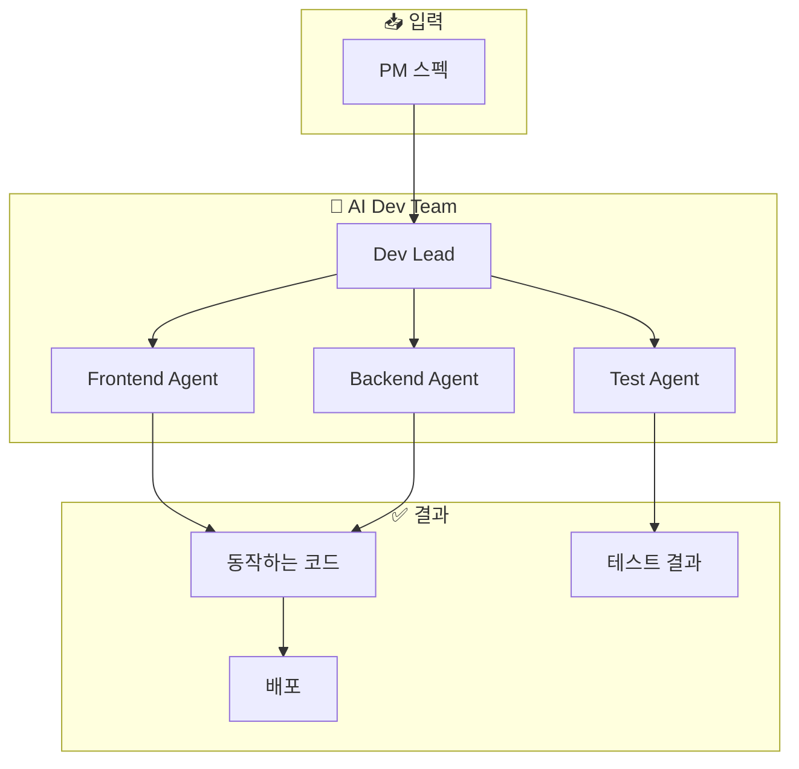
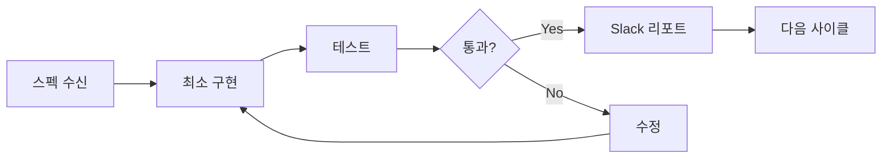

# AI Dev Team

> AI 개발팀 - 스펙 기반 구현, 테스트, 배포를 수행하는 AI 에이전트 팀의 Monorepo

## 개요

AI Dev Team은 PM으로부터 받은 스펙을 기반으로 실제 구현을 담당하는 AI 에이전트 팀입니다:

- 스펙 기반 구현
- 테스트 작성 & 실행
- 배포 & 모니터링
- 공유 패키지 관리

## 아키텍처



## Monorepo 구조

```
ai-devteam/
├── apps/              # 애플리케이션 프로젝트
├── packages/          # 공유 패키지
├── tools/             # 내부 도구
├── boilerplates/      # 프로젝트 템플릿
├── agent-docs/        # AI 참조 문서
├── human-docs/        # 인간용 문서
└── sessions/          # 세션 기록
```

## 기술 스택

| 구분 | 기술 |
|------|------|
| Package Manager | pnpm |
| Build System | Turborepo |
| Language | TypeScript |

## 마이크로 사이클



### 사이클 원칙

| 원칙 | 설명 |
|------|------|
| **최소 구현** | 스펙의 핵심만 먼저 구현 |
| **즉시 테스트** | 구현 즉시 테스트 가능해야 함 |
| **빠른 피드백** | 2시간 이내 검증 가능한 단위 |

## Repository

- **GitHub**: [org-tinysolver/ai-devteam](https://github.com/org-tinysolver/ai-devteam)
- **상태**: 🟢 운영 중
