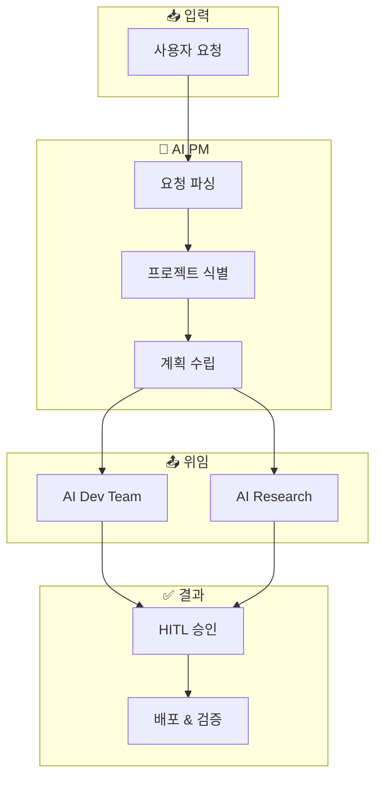

# AI PM

> Intelligent Project Manager - GitHub Projects와 연동하여 작업을 자동 관리하고, AI 에이전트에게 위임하는 지능형 프로젝트 매니저

## 개요

AI PM은 다음을 수행하는 지능형 프로젝트 매니저입니다:

- 서비스/프로덕트 컨텍스트 이해
- 관련 Repository 자동 식별
- 빌드/배포 타입 결정 (web, CLI, native app)
- 프리뷰 배포 연결
- 태스크 기반 진행 관리
- 전문 AI 에이전트에게 작업 위임
- Human-in-the-Loop (HITL) 체크포인트 관리

## 아키텍처



## 핵심 원칙

| 원칙 | 설명 |
|------|------|
| **Incremental Development** | 항상 단계별로 작업 |
| **MVP First** | 핵심 기능만 포함한 동작하는 제품 먼저 출시 |
| **Iterative Enhancement** | 코어 기능 이후 점진적 개선 |

## 문서 구조

```
ai-pm/
├── CLAUDE.md              # 🤖 AI 진입점 (자동 로드)
├── README.md              # 👤 인간용 빠른 시작
├── human-docs/            # 👤 인간 전용 - Source of Truth
│   ├── standards/         # 조직 표준
│   ├── decisions/         # Architecture Decision Records
│   ├── principles/        # 핵심 가치 & 철학
│   └── guides/            # 상세 가이드
├── agent-docs/            # 🤖 AI 참조
│   ├── rules/             # AI가 따를 규칙
│   ├── templates/         # AI가 사용할 템플릿
│   └── schemas/           # 데이터 구조 정의
├── projects/              # 📁 프로젝트 설정
└── workflows/             # ⚙️ 자동화 워크플로우
```

## 관리 프로젝트

| 프로젝트 | Repository | 배포 타겟 | 타입 |
|---------|------------|-----------|------|
| TinySolver.me | org-tinysolver/tinysolver.me | https://tinysolver.me | Web (Cloudflare Pages) |

## Repository

- **GitHub**: [org-tinysolver/ai-pm](https://github.com/org-tinysolver/ai-pm)
- **상태**: 🟢 운영 중
