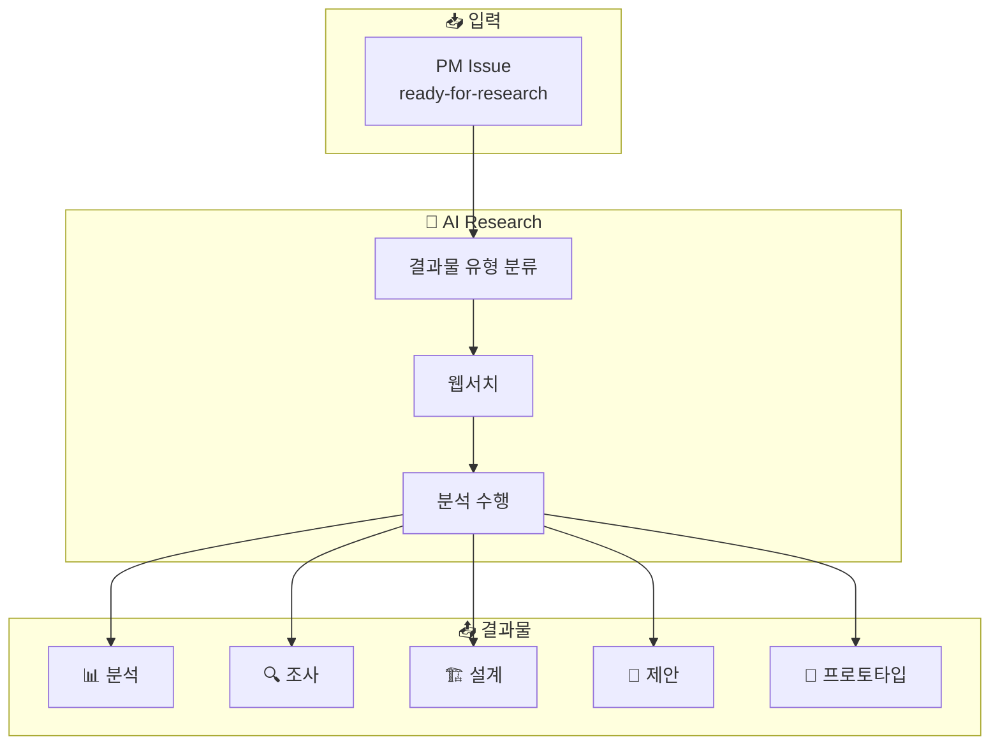
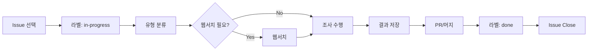

# AI Research

> Research Agent - PM이 위임한 조사/분석 작업을 수행하는 리서치팀

## 개요

AI Research는 PM으로부터 위임받은 기술 조사, 분석, PoC 작업을 수행하는 AI 에이전트 팀입니다:

- 기술 탐색 & 조사
- 가설 검증
- PoC 제작
- 비교 분석

## 아키텍처



## 핵심 규칙

| 규칙 | 설명 |
|------|------|
| **Issue-Driven** | `ready-for-research` 라벨 Issue만 작업 |
| **Self-Contained** | Issue만 보고 바로 작업, 외부 참조 금지 |
| **30분 Rule** | 1 Issue = 30분 이내 완료 |
| **Scope Lock** | Issue에 명시된 것만 조사, 추가 조사 금지 |
| **Web Search First** | 타겟이 한정되지 않은 요청은 웹서치 먼저 |

## 결과물 유형

```
outputs/
├── analysis/     # 📊 기술 분석 - "A vs B 어떤 게 나아?"
├── survey/       # 🔍 기술 조사 - "이 분야 뭐가 있어?"
├── design/       # 🏗️ 시스템 설계 - "이걸 어떻게 만들지?"
├── proposal/     # 📝 제안서 - "이렇게 하면 어때?"
└── prototype/    # 🔧 프로토타입 - 실제 코드
```

## 워크플로우



## 라벨 시스템

| 라벨 | 의미 | 누가 붙이나 |
|------|------|-----------|
| `ready-for-research` | 작업 가능 | PM 또는 DevTeam |
| `in-progress` | 작업 중 | Research |
| `blocked` | 블로커 있음 | Research |
| `done` | 완료됨 | Research |

## Repository

- **GitHub**: [org-tinysolver/ai-research](https://github.com/org-tinysolver/ai-research)
- **상태**: 🟢 운영 중
