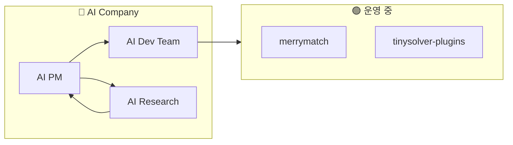

# 프로덕트 오버뷰

현재 운영 중인 서비스들의 전체 구조입니다. 각 서비스를 클릭하면 상세 온보딩 가이드로 이동합니다.

## 서비스 맵

## AI Company

AI 에이전트로 구성된 회사입니다. 각 에이전트가 역할을 분담하여 제품을 기획, 개발, 조사합니다.

| 서비스 | 상태 | 설명 | 역할 |
|--------|------|------|------|
| [AI PM](./ai-pm/overview) | 🟢 운영 | 지능형 프로젝트 매니저 | 기획, 위임, HITL 관리 |
| [AI Dev Team](./ai-devteam/overview) | 🟢 운영 | AI 개발팀 Monorepo | 구현, 테스트, 배포 |
| [AI Research](./ai-research/overview) | 🟢 운영 | 리서치 에이전트팀 | 조사, 분석, PoC |

## 서비스 목록

| 서비스 | 상태 | 설명 | 담당자 |
|--------|------|------|--------|
| [merrymatch](./merrymatch/overview) | 🟢 운영 | <!-- TODO: 한줄 설명 --> | <!-- TODO --> |
| [tinysolver-plugins](./tinysolver-plugins/overview) | 🟢 운영 | <!-- TODO: 한줄 설명 --> | <!-- TODO --> |

---

:::tip 새 프로덕트 추가하기
1. `docs/products/<프로덕트명>/` 폴더 생성
2. `overview.mdx` 작성 (아키텍처 다이어그램 포함)
3. `sidebars.js`에 추가
4. 이 페이지의 서비스 맵과 목록 업데이트
:::
