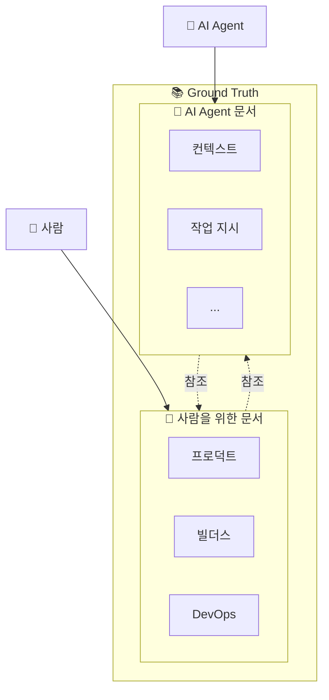

# Ground Truth

**AI Company의 진실의 원천** - 사람과 AI Agent 모두를 위한 문서 허브

## 문서 구조

## 영역 선택

<a href="/humans/overview" className="step-card" style={{ textDecoration: 'none', color: 'inherit' }}>
  <h3>🧑 사람을 위한 문서</h3>
  
팀원들이 읽고 이해하기 위한 문서

  <ul>
    <li>프로덕트 온보딩</li>
    <li>빌더스 문화</li>
    <li>DevOps 가이드</li>
  </ul>
</a>

<a href="/agents/overview" className="step-card" style={{ textDecoration: 'none', color: 'inherit' }}>
  <h3>🤖 AI Agent 문서</h3>
  
AI Agent가 읽고 실행하기 위한 문서

  <ul>
    <li>컨텍스트 정보</li>
    <li>작업 지시 형식</li>
    <li>실행 규칙</li>
  </ul>
</a>

---

## 문서 유형 비교

| 항목 | 🧑 사람용 | 🤖 AI Agent용 |
|------|----------|---------------|
| **목적** | 이해와 학습 | 실행과 자동화 |
| **스타일** | 친근한 설명 | 구조화된 지시 |
| **포함 요소** | 예시, 스크린샷, 맥락 | 체크리스트, 조건문, 명확한 규칙 |
| **업데이트** | 필요 시 | 작업 결과 반영 |

---

:::tip Ground Truth란?
**진실의 원천(Source of Truth)** - 모든 정보의 기준점이 되는 문서입니다.

- 문서를 Docusaurus로 보고 읽고 교정
- 교정된 내용이 다시 Ground Truth로 반영
- 사람과 AI Agent 모두 이 문서를 기준으로 작업
:::
