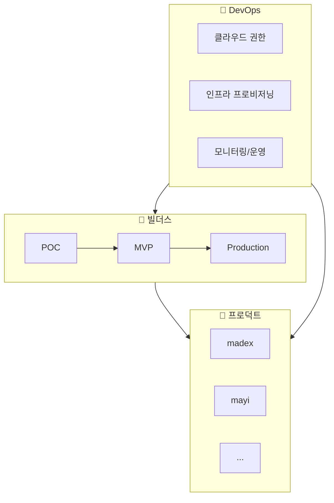

# 온보딩 허브

팀의 모든 온보딩 가이드를 한 곳에서 확인하세요.

import Checklist from '@site/src/components/Checklist';

## 전체 구조

## 온보딩 영역

<a href="/products/overview" className="step-card" style={{ textDecoration: 'none', color: 'inherit' }}>
  <h3>🚀 프로덕트</h3>
  
서비스별 온보딩 가이드

  <ul>
    <li>madex - 광고 플랫폼</li>
    <li>mayi - AI 서비스</li>
    <li>신규 서비스...</li>
  </ul>
</a>

<a href="/builders/overview" className="step-card" style={{ textDecoration: 'none', color: 'inherit' }}>
  <h3>🔨 빌더스</h3>
  
혼자서 끝까지 만드는 문화

  <ul>
    <li>POC → MVP → Production</li>
    <li>버티컬 슬라이스 개발</li>
    <li>오픈소스 스타일 확장</li>
  </ul>
</a>

<a href="/devops/overview" className="step-card" style={{ textDecoration: 'none', color: 'inherit' }}>
  <h3>🔧 DevOps</h3>
  
인프라 프로비저닝 & 운영

  <ul>
    <li>클라우드 권한 획득</li>
    <li>IaC / Terraform</li>
    <li>모니터링 & 로깅</li>
  </ul>
</a>

## 신규 입사자 체크리스트

<Checklist items={[
  { id: 'products', label: '프로덕트 구조 파악하기' },
  { id: 'builders', label: '빌더 문화 이해하기' },
  { id: 'cloud', label: '클라우드 권한 획득 (AWS, GCP, Azure)' },
  { id: 'tools', label: '개발 도구 설치' },
  { id: 'first-pr', label: '첫 번째 PR 올리기' },
]} />

---

:::tip 어디서부터 시작할까?
- **신규 입사자**: 프로덕트 → 빌더스 → DevOps 순서로
- **새 프로젝트 시작**: 빌더스 가이드부터
- **인프라 권한 필요**: DevOps 클라우드 권한 획득부터
:::
