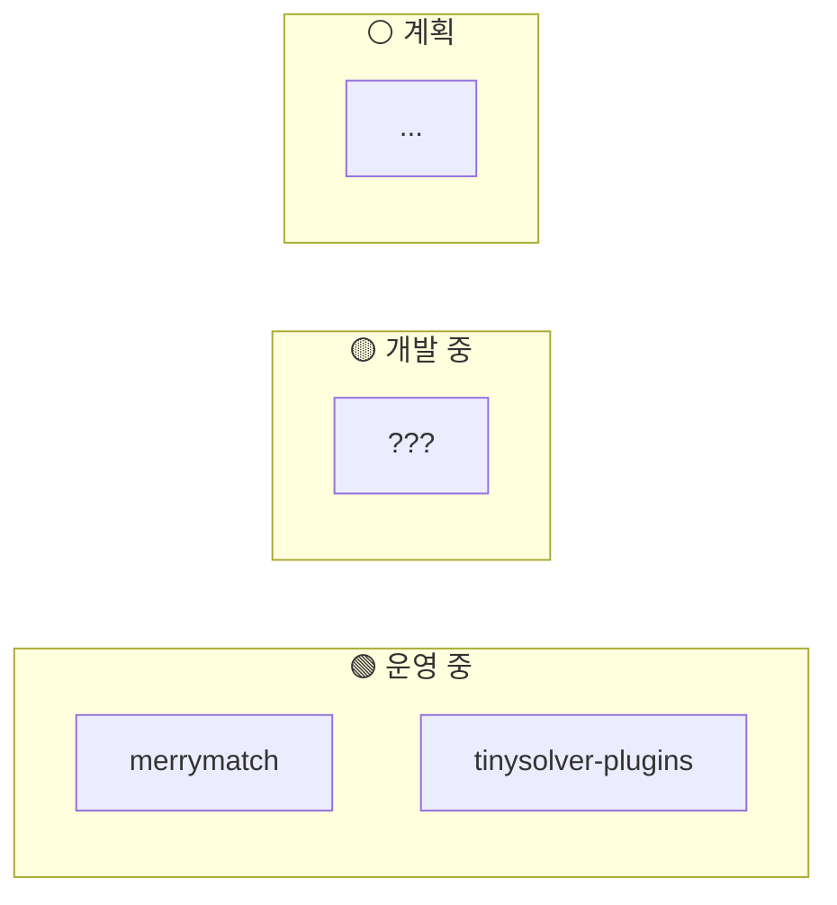

# 프로덕트 오버뷰

현재 운영 중인 서비스들의 전체 구조입니다. 각 서비스를 클릭하면 상세 온보딩 가이드로 이동합니다.

## 서비스 맵

## 서비스 목록

| 서비스 | 상태 | 설명 | 담당자 |
|--------|------|------|--------|
| [merrymatch](./merrymatch/overview) | 🟢 운영 | <!-- TODO: 한줄 설명 --> | <!-- TODO --> |
| [tinysolver-plugins](./tinysolver-plugins/overview) | 🟢 운영 | <!-- TODO: 한줄 설명 --> | <!-- TODO --> |

---

:::tip 새 프로덕트 추가하기
1. `docs/products/<프로덕트명>/` 폴더 생성
2. `overview.mdx` 작성 (아키텍처 다이어그램 포함)
3. `sidebars.js`에 추가
4. 이 페이지의 서비스 맵과 목록 업데이트
:::
