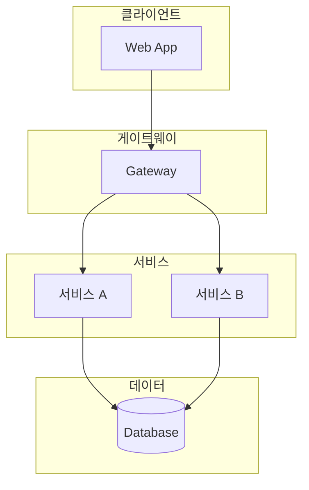

# tinysolver-plugins

<!-- TODO: tinysolver-plugins 서비스 한줄 소개 -->

:::info 작성 필요
이 문서는 작성이 필요합니다. 담당자가 내용을 채워주세요!
:::

---

## 서비스 구조도



:::warning TODO
위 다이어그램은 예시입니다. 실제 tinysolver-plugins 아키텍처에 맞게 수정해주세요.
:::

---

## 기술 스택

| 분류 | 기술 |
|------|------|
| Frontend | <!-- TODO --> |
| Backend | <!-- TODO --> |
| Database | <!-- TODO --> |
| Infra | <!-- TODO --> |

---

## 주요 저장소

| 저장소 | 설명 |
|--------|------|
| <!-- TODO: 저장소 URL --> | <!-- TODO: 설명 --> |

---

## 로컬 개발 환경

<!-- TODO: 로컬 환경 셋업 방법 -->

### 사전 요구사항

- [ ] <!-- TODO: 필요한 도구들 -->

### 설치 및 실행

```bash
# TODO: 설치 명령어
```

---

## 환경별 접속 정보

| 환경 | URL | 비고 |
|------|-----|------|
| 개발 | <!-- TODO --> | |
| 스테이징 | <!-- TODO --> | |
| 운영 | <!-- TODO --> | |

---

## 담당자

| 역할 | 담당자 |
|------|--------|
| 서비스 오너 | <!-- TODO --> |
| 백엔드 | <!-- TODO --> |
| 프론트엔드 | <!-- TODO --> |
| 인프라 | <!-- TODO --> |

